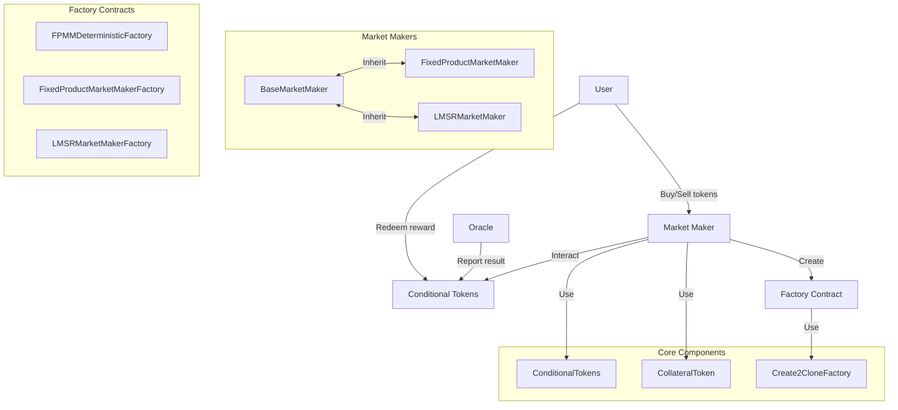
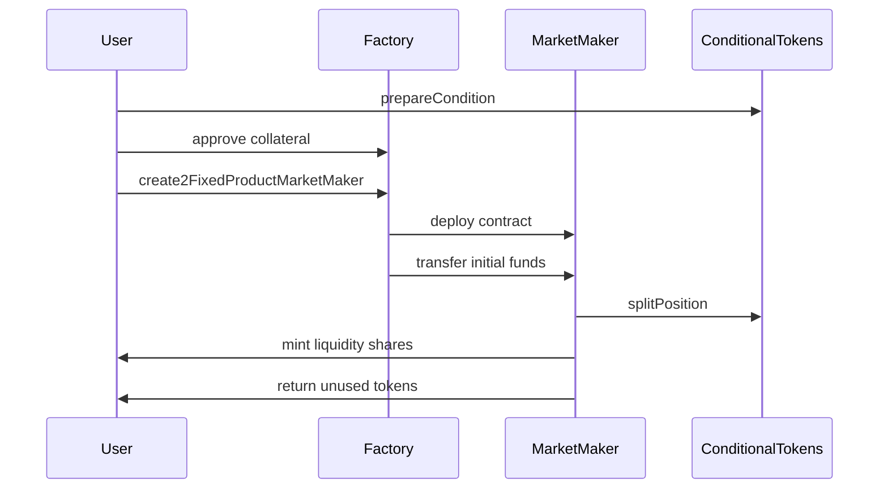
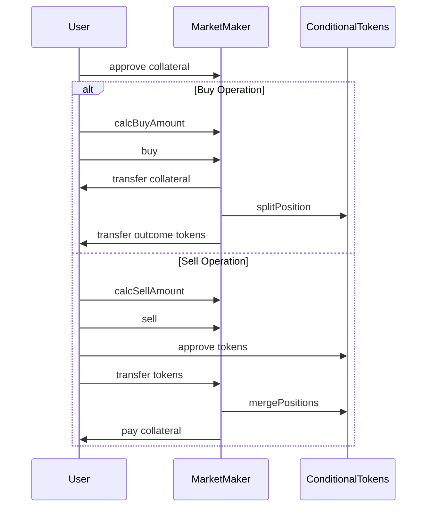
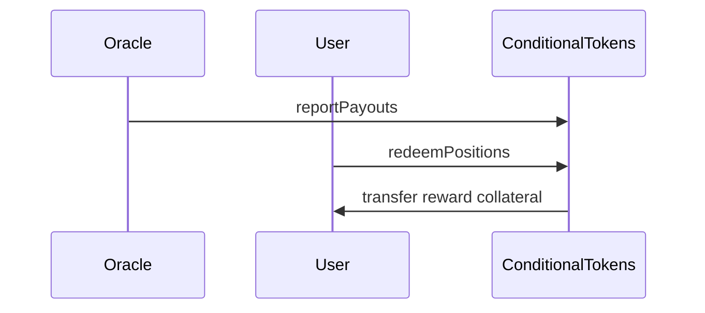

# 条件代币市场做市商系统架构设计

## 1. 系统架构图



## 2. 系统组件说明

### 2.1 核心组件

#### ConditionalTokens
- 条件代币核心合约，由Gnosis Protocol提供
- 管理条件的创建、代币的拆分和合并
- 处理预言机结果报告和用户代币赎回

#### 抵押品Token
- 通常是ERC20代币（如WETH）
- 用于为市场提供流动性和支持交易

#### Create2CloneFactory
- 提供确定性地址创建功能
- 使用CREATE2和代理模式降低合约部署成本

### 2.2 市场做市商

#### MarketMaker（基类）
- 定义基本接口和行为
- 支持暂停、恢复和关闭市场
- 管理资金和费用

#### FixedProductMarketMaker
- 实现固定产品做市商算法
- 使用恒积函数(x₁*x₂*...*xₙ=k)计算价格
- 支持添加和移除流动性

#### LMSRMarketMaker
- 实现对数市场评分规则做市商
- 使用指数函数计算价格
- 适用于预测市场场景

### 2.3 工厂合约

#### FPMMDeterministicFactory
- 使用CREATE2创建可预测地址的做市商
- 支持初始化参数设置

#### FixedProductMarketMakerFactory
- 创建常规的固定产品做市商
- 不保证地址可预测性

#### LMSRMarketMakerFactory
- 创建LMSR做市商实例

## 3. 系统流程图

### 3.1 创建市场流程



### 3.2 交易流程



### 3.3 赎回流程



## 4. 关键功能实现

### 4.1 市场创建与资金管理

FixedProductMarketMaker实现了以下资金管理功能：

- **addFunding**: 增加市场流动性，铸造流动性份额
- **removeFunding**: 移除市场流动性，销毁流动性份额
- **withdrawFees**: 提取交易费用

### 4.2 交易机制

- **buy**: 购买特定结果的条件代币
- **sell**: 出售特定结果的条件代币
- **calcBuyAmount/calcSellAmount**: 计算交易金额和代币数量

### 4.3 价格确定机制

#### FixedProductMarketMaker
使用恒积函数(x₁*x₂*...*xₙ=k)确定价格，类似于Uniswap的算法。

#### LMSRMarketMaker
使用指数函数计算价格:
```
P(i) = exp(q(i)/b) / sum(exp(q(j)/b) for all j)
```
其中:
- P(i)是结果i的价格
- q(i)是结果i的数量
- b是流动性参数

## 5. 测试用例实例分析

从测试用例中，我们可以看到系统的实际操作流程：

### 5.1 创建和资金注入

```javascript
// 1. 准备条件
await conditionalTokens.prepareCondition(oracle, questionId, numOutcomes);

// 2. 创建做市商
const createArgs = [
    saltNonce,
    conditionalTokens.address,
    collateralToken.address,
    [conditionId],
    feeFactor,
    initialFunds,
    initialDistribution,
    { from: creator }
];
const fixedProductMarketMakerAddress = await fpmmDeterministicFactory.create2FixedProductMarketMaker.call(...createArgs);
```

### 5.2 购买代币示例

```javascript
// 1. 计算购买量
const investmentAmount = toBN(1e18);
const buyOutcomeIndex = 1;
const outcomeTokensToBuy = await fixedProductMarketMaker.calcBuyAmount(investmentAmount, buyOutcomeIndex);

// 2. 执行购买
await fixedProductMarketMaker.buy(investmentAmount, buyOutcomeIndex, outcomeTokensToBuy, { from: trader });
```

### 5.3 出售代币示例

```javascript
// 1. 计算出售量
const returnAmount = toBN(1e17);
const sellOutcomeIndex = 1;
const outcomeTokensToSell = await fixedProductMarketMaker.calcSellAmount(returnAmount, sellOutcomeIndex);

// 2. 执行出售
await fixedProductMarketMaker.sell(returnAmount, sellOutcomeIndex, outcomeTokensToSell, { from: trader });
```

## 6. 赛事结束与奖金获取流程

当赛事结束后，用户获取奖金的流程如下：

1. **预言机报告结果**:
   预言机向ConditionalTokens合约报告赛事结果，确定哪些条件为真。

2. **用户赎回条件代币**:
   用户通过ConditionalTokens合约的`redeemPositions`函数赎回持有的获胜条件代币。

3. **奖金计算**:
   - 系统根据预言机报告的结果计算每个条件代币的价值
   - 只有与真实结果匹配的条件代币才有价值
   - 赎回金额与用户持有的条件代币数量成正比

4. **奖金发放**:
   用户成功赎回后，对应的抵押品会自动转入用户的钱包地址。

整个过程会触发`PayoutRedemption`事件，记录谁赎回了什么代币以及获得了多少奖励。

## 7. 优势与限制

### 优势
- 支持复杂的条件组合和多结果预测市场
- 自动化的价格发现机制
- 灵活的流动性管理
- 确定性地址创建，便于集成

### 限制
- 对于低流动性市场，可能存在较大滑点
- 复杂条件组合可能导致高gas费用
- 依赖预言机报告的准确性和及时性

## 8. 总结

条件代币市场做市商系统是一个完整的预测市场解决方案，结合了条件代币的灵活性和自动化市场做市商的流动性。通过使用不同的做市算法（恒积函数和LMSR），系统可以适应不同类型的市场需求。用户可以交易与特定事件结果相关的代币，并在事件结束后根据实际结果获取相应的奖励。 