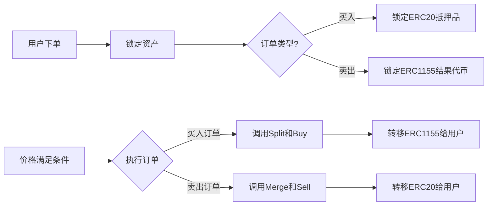

# ERC1155标准在限价单系统升级中的处理方案

在我们按照Uniswap V4风格设计的限价单系统中，一个需要特别关注的关键点是条件代币使用的ERC1155代币标准。这与Uniswap V4基于ERC20代币对的架构存在重要差异，需要专门设计适配方案。

## 1. ERC1155与ERC20的主要差异

条件代币市场中的结果代币使用ERC1155多代币标准，而不是传统的ERC20单一代币标准。这带来以下差异：

1. **代币标识**：ERC1155使用ID来区分不同类型的代币，单个合约可管理多种代币
2. **批量转账**：支持多种代币类型的批量转账
3. **接收者接口**：接收者需要实现`ERC1155TokenReceiver`接口
4. **余额查询**：使用不同的查询方式（`balanceOfBatch`而非`balanceOf`）
5. **授权机制**：使用`setApprovalForAll`而非`approve`
6. **缺乏原生小数支持**：ERC1155没有内置的decimals属性，默认小数位为0

查看现有代码，可以看到`FixedProductMarketMaker`合约已实现了`ERC1155TokenReceiver`接口：

```solidity
contract FixedProductMarketMaker is ERC20, ERC1155TokenReceiver {
    // ...合约内容
}
```

## 2. 对限价单系统设计的影响

### 2.1 资产处理流程的差异

Uniswap V4的限价单系统主要处理ERC20代币对，而条件代币市场需要处理ERC1155代币和抵押品ERC20代币之间的转换：



### 2.2 访问控制与安全考量

当系统处理ERC1155资产时，需要特别注意：

1. **精确追踪positionId**：每个条件和结果对应不同的positionId
2. **批量操作的完整性检查**：确保批量操作中每一步都成功
3. **资产接收处理**：正确实现`onERC1155Received`和`onERC1155BatchReceived`

### 2.3 ERC1155小数处理

虽然ERC1155没有原生小数支持，但条件代币系统通过以下方式间接支持小数：

1. **隐式小数位**：系统使用类似于ERC20的18位小数约定，这在代码中常表现为：
   ```solidity
   uint constant ONE = 10**18;
   ```

2. **标准化计算**：所有数量都以10^18为基础单位进行计算，1个完整的条件代币在合约内部表示为10^18个基本单位

3. **比例转换**：代码中通常会看到的乘以`ONE`或`1e18`和除以`ONE`的操作，是为了保持小数精度：
   ```solidity
   // 例如价格计算
   return balances[outcomeIndex] * 1e18 / totalBalance;
   ```

## 3. 升级实施中需要特别注意的地方

### 3.1 LimitOrderHook合约的ERC1155适配

```solidity
// 在LimitOrderHook合约中
contract LimitOrderHook is IMarketHook, ERC1155TokenReceiver {
    // 常量定义
    uint constant ONE = 10**18;  // 用于小数计算
    
    // 实现批量接收ERC1155资产的回调函数
    function onERC1155BatchReceived(
        address operator,
        address from,
        uint256[] calldata ids,
        uint256[] calldata values,
        bytes calldata data
    ) external returns (bytes4) {
        // 验证发送者是否为conditionalTokens合约
        require(msg.sender == address(conditionalTokens), "Invalid sender");
        
        // 处理接收到的结果代币
        // ...实现逻辑
        
        return this.onERC1155BatchReceived.selector;
    }
    
    function onERC1155Received(
        address operator,
        address from,
        uint256 id,
        uint256 value,
        bytes calldata data
    ) external returns (bytes4) {
        // 验证发送者
        require(msg.sender == address(conditionalTokens), "Invalid sender");
        
        // 处理接收到的结果代币
        // ...实现逻辑
        
        return this.onERC1155Received.selector;
    }
}
```

### 3.2 订单执行过程中的ERC1155处理

```solidity
// LimitOrderHook中的卖单执行实现
function executeSellOrder(uint orderId, address marketMaker) internal {
    Order storage order = orders[orderId];
    
    // 获取positionId
    uint positionId = getPositionId(IMarketMaker(marketMaker), order.outcomeIndex);
    
    // 首先批准市场合约使用代币
    conditionalTokens.setApprovalForAll(marketMaker, true);
    
    // 注意：order.amount已经是以10^18为单位的值
    // 例如：要卖出0.5个代币，order.amount应为5*10^17
    
    // 执行卖出
    try IHookableFixedProductMarketMaker(marketMaker).sell(
        order.amount,
        order.outcomeIndex,
        order.minReturnAmount
    ) returns (uint returnAmount) {
        // 处理返回的抵押品
        IERC20 collateralToken = IERC20(IHookableFixedProductMarketMaker(marketMaker).collateralToken());
        require(collateralToken.transfer(order.owner, returnAmount), "Transfer failed");
    } catch {
        // 错误处理
    }
}
```

### 3.3 Split和Merge操作的特殊处理

对于买单和卖单，需要分别处理Split和Merge操作：

```solidity
// 对卖单执行merge操作
function prepareSellOrderExecution(address marketMaker, uint positionId, uint amount) internal {
    IHookableFixedProductMarketMaker market = IHookableFixedProductMarketMaker(marketMaker);
    
    // 检查是否需要merge操作
    bytes32[] memory conditionIds = market.getConditionIds();
    if (conditionIds.length > 1) {
        // 如果有多个条件，需要先执行merge操作
        for (uint i = conditionIds.length - 1; int(i) >= 0; i--) {
            // 执行merge逻辑
            bytes32 conditionId = conditionIds[i];
            // ...merge过程
        }
    }
}
```

## 4. Tick系统与ERC1155的集成

### 4.1 Tick索引与positionId映射

由于Tick系统是为ERC20代币对设计的，需要额外的映射关系来处理ERC1155代币的positionId：

```solidity
// 在LimitOrderHook中添加
// 市场和结果索引到positionId的映射
mapping(address => mapping(uint => uint)) public positionIdByMarketAndOutcome;

// 初始化positionId映射
function initializePositionIds(address marketMaker) public {
    IHookableFixedProductMarketMaker market = IHookableFixedProductMarketMaker(marketMaker);
    uint[] memory positions = market.getPositionIds();
    
    for (uint i = 0; i < positions.length; i++) {
        positionIdByMarketAndOutcome[marketMaker][i] = positions[i];
    }
}
```

### 4.2 Tick系统中的小数处理

```solidity
// 在TickMath库中处理小数
library TickMath {
    uint constant ONE = 10**18;  // 用于精度计算
    int24 public constant MIN_TICK = -887272;
    int24 public constant MAX_TICK = 887272;
    int24 public constant TICK_SPACING = 10;

    // 价格到Tick的转换，考虑到价格已经是18位小数形式
    function priceToTick(uint256 price) internal pure returns (int24) {
        // price已经是按10^18单位表示的价格
        // 例如：0.5将表示为5*10^17
        
        // 注意：这里我们需确保log1.0001函数能正确处理以10^18为单位的输入
        // FixedPoint96.Q96是Uniswap的定点表示常量 (2^96)
        return int24(log1.0001(price * 2**96 / ONE));
    }

    // Tick到价格的转换，返回18位小数形式的价格
    function tickToPrice(int24 tick) internal pure returns (uint256) {
        // 先计算原始价格值
        uint256 rawPrice = uint256(1.0001 ** tick);
        
        // 转换为18位小数表示
        return rawPrice * ONE / 2**96;
    }
}
```

### 4.3 Tick区间与ERC1155批量处理

处理Tick区间内的订单时，需要高效处理ERC1155资产，并正确处理小数：

```solidity
// 批量执行特定tick范围内的订单
function executeBatchSellOrders(
    address marketMaker, 
    uint outcomeIndex, 
    int24 fromTick, 
    int24 toTick
) internal {
    // 收集所有需要执行的订单
    uint[] memory orderIds = collectExecutableSellOrders(
        marketMaker, 
        outcomeIndex, 
        fromTick, 
        toTick
    );
    
    if (orderIds.length == 0) return;
    
    // 准备positionId数组
    uint[] memory positionIds = new uint[](orderIds.length);
    uint[] memory amounts = new uint[](orderIds.length);
    
    // 填充需要处理的代币数据
    for (uint i = 0; i < orderIds.length; i++) {
        Order storage order = orders[orderIds[i]];
        positionIds[i] = positionIdByMarketAndOutcome[marketMaker][order.outcomeIndex];
        
        // amounts已经是以10^18为单位的值，不需要额外转换
        amounts[i] = order.amount;
    }
    
    // 一次性批准所有代币给市场合约
    conditionalTokens.setApprovalForAll(marketMaker, true);
    
    // 执行订单
    for (uint i = 0; i < orderIds.length; i++) {
        executeSellOrder(orderIds[i], marketMaker);
    }
}
```

## 5. 价格计算与小数处理

### 5.1 价格/Tick转换中的小数处理

```solidity
// 在HookableFixedProductMarketMaker中计算价格并转换为Tick
function calculateOutcomePrice(uint outcomeIndex) public view returns (uint) {
    uint[] memory balances = getPoolBalances();
    uint totalBalance = 0;
    
    for (uint i = 0; i < balances.length; i++) {
        totalBalance += balances[i];
    }
    
    if (totalBalance == 0) return 0;
    
    // 返回的价格已经是18位小数表示
    return balances[outcomeIndex] * ONE / totalBalance;
}

// 在限价单Hook中使用
function placeBuyLimitOrder(
    address marketMaker,
    uint outcomeIndex,
    uint price,  // 传入的价格已是18位小数表示，例如0.7表示为7*10^17
    uint amount, // 传入的金额也是18位小数表示
    uint expiration
) external returns (uint256 orderId) {
    // 验证参数
    require(amount > 0, "Amount must be > 0");
    require(price > 0, "Price must be > 0");
    
    // 计算价格对应的tick
    int24 limitTick = TickMath.priceToTick(price);
    
    // 创建订单逻辑...
}
```

### 5.2 修改后的订单执行逻辑

```solidity
// 执行买入限价单
function executeBuyOrder(uint256 orderId, address marketMaker) internal {
    Order storage order = orders[orderId];
    
    // 获取当前价格（已是18位小数表示）
    uint currentPrice = IHookableFixedProductMarketMaker(marketMaker).calculateOutcomePrice(order.outcomeIndex);
    
    // 验证价格条件
    require(currentPrice <= order.price, "Price condition not met");
    
    // 计算期望获得的结果代币数量
    // 注意：所有计算始终保持18位小数精度
    uint expectedOutcomeTokens = order.amount * ONE / currentPrice;
    
    // 设置最小接收数量（添加1%滑点保护）
    uint minOutcomeTokens = expectedOutcomeTokens * 99 / 100;
    
    // 执行买入
    try IHookableFixedProductMarketMaker(marketMaker).buy(
        order.amount,
        order.outcomeIndex,
        minOutcomeTokens
    ) returns (uint outcomeTokensBought) {
        // 获取positionId
        uint positionId = positionIdByMarketAndOutcome[marketMaker][order.outcomeIndex];
        
        // 将结果代币转给用户
        conditionalTokens.safeTransferFrom(
            address(this),
            order.owner,
            positionId,
            outcomeTokensBought,
            ""
        );
    } catch {
        // 错误处理
    }
}
```

## 6. 具体升级变更

### 6.1 步骤1：修改Hook接口以支持ERC1155与小数处理

```solidity
// 在contracts/interfaces/IMarketHook.sol中添加ERC1155支持
interface IMarketHook {
    // 定义小数常量
    uint constant ONE = 10**18;
    
    // 现有接口
    function beforeSwap(...) external;
    function afterSwap(...) external;
    
    // 添加ERC1155处理方法
    function onTokenTransfer(
        address marketMaker,
        uint[] calldata positionIds,
        uint[] calldata amounts,  // 数量已是以10^18为单位
        address to
    ) external returns (bool);
}
```

### 6.2 步骤2：扩展Tick系统支持ERC1155批量操作和小数处理

原始升级计划的`TickMath`库需要扩展以支持positionId的映射和小数处理：

```solidity
// 在contracts/libraries/TickMath.sol中添加
library TickMath {
    // 定义小数常量
    uint constant ONE = 10**18;
    
    // 现有常量
    int24 public constant MIN_TICK = -887272;
    int24 public constant MAX_TICK = 887272;
    int24 public constant TICK_SPACING = 10;
    
    // 价格到Tick的转换，处理18位小数
    function priceToTick(uint256 price) internal pure returns (int24) {
        // 转换算法，处理18位小数格式的价格
        return int24(log1.0001(price * 2**96 / ONE));
    }
    
    // Tick到价格的转换，返回18位小数格式
    function tickToPrice(int24 tick) internal pure returns (uint256) {
        return uint256(1.0001 ** tick) * ONE / 2**96;
    }
    
    // 添加处理positionId批量转换的方法
    function getTickRangeForPositionIds(
        uint[] memory positionIds,
        uint[] memory amounts,
        mapping(uint => int24) storage positionIdToTick
    ) internal view returns (int24 minTick, int24 maxTick) {
        // 实现逻辑
    }
}
```

### 6.3 步骤3：在LimitOrderHook中实现ERC1155接口与小数处理

除了上面提到的`onERC1155Received`和`onERC1155BatchReceived`外，还需要实现其他关键方法，并处理小数：

```solidity
// 在LimitOrderHook中添加
function placeSellLimitOrder(
    address marketMaker,
    uint outcomeIndex,
    uint price,  // 传入的价格已是18位小数表示
    uint amount, // 传入的数量也是18位小数表示
    uint minReturnAmount,
    uint expiration
) external returns (uint orderId) {
    // 获取positionId
    uint positionId = positionIdByMarketAndOutcome[marketMaker][outcomeIndex];
    require(positionId != 0, "Invalid position");
    
    // 锁定用户ERC1155代币（数量已经是标准化的，不需额外转换）
    conditionalTokens.safeTransferFrom(
        msg.sender,
        address(this),
        positionId,
        amount,
        ""  // 不需要额外数据
    );
    
    // 计算对应的tick
    int24 limitTick = TickMath.priceToTick(price);
    
    // 创建订单
    orderId = nextOrderId++;
    orders[orderId] = Order({
        owner: msg.sender,
        marketMaker: marketMaker,
        outcomeIndex: outcomeIndex,
        price: price,
        limitTick: limitTick,
        amount: amount,
        minReturnAmount: minReturnAmount,
        expiration: expiration > 0 ? block.timestamp + expiration : 0,
        active: true,
        filled: 0
    });
    
    // 添加到tick索引
    sellOrdersByTick[marketMaker][outcomeIndex][limitTick].push(orderId);
    
    emit OrderPlaced(orderId, msg.sender, marketMaker, false, outcomeIndex, price, limitTick, amount);
    
    return orderId;
}
```

## 7. 风险与缓解措施

| 风险类型 | 描述 | 缓解措施 |
|---------|------|----------|
| 资产锁定 | ERC1155代币可能被永久锁定在合约中 | 添加紧急取回机制，增加超时自动取消功能 |
| 批量操作失败 | 批量操作部分成功可能导致状态不一致 | 使用更细粒度的错误处理，设计失败回滚机制 |
| Gas成本增加 | ERC1155操作可能需要更多gas | 优化批处理逻辑，批量处理订单 |
| ID映射错误 | positionId映射错误导致错误转账 | 添加多重验证，实现链上验证机制 |
| 小数精度损失 | 小数转换过程中可能损失精度 | 在关键计算步骤添加额外的精度检查 |
| 价格表示不一致 | 前后端可能对价格有不同理解 | 明确文档说明所有价格和金额都是18位小数，加强输入验证 |

## 8. 总结

将Uniswap V4风格的Hook和Tick系统应用于基于ERC1155的条件代币市场，需要解决多个技术挑战，主要包括：

1. 资产类型差异（ERC20 vs ERC1155）的处理
2. 批量操作和高效率索引的实现
3. positionId与Tick系统的映射关系维护
4. Split/Merge操作与Hook回调的整合
5. **ERC1155缺乏原生小数支持的问题处理**

虽然ERC1155标准没有内置的小数支持，但通过维持18位小数的表示方式，我们可以无缝集成到现有系统，确保价格和数量计算的精确性。这种方法借鉴了ERC20代币的惯例，但需要在代码中明确处理，确保所有计算保持一致的精度。

通过本文提出的处理方案，我们可以在保持系统效率的同时，充分利用ERC1155标准的优势和正确处理小数问题，为条件代币市场提供高效可靠的限价单功能。这些考量已经融入到升级计划中，确保系统安全稳定地过渡到新的架构。 