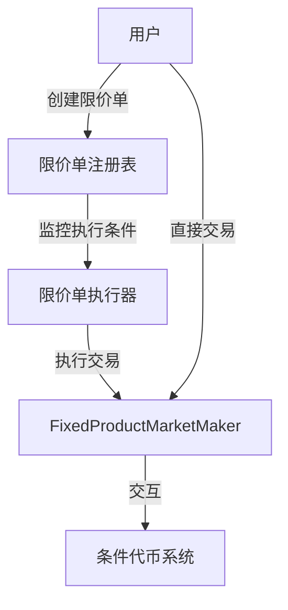
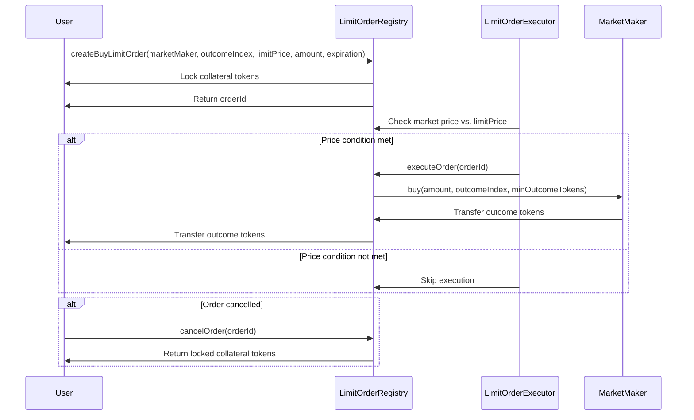
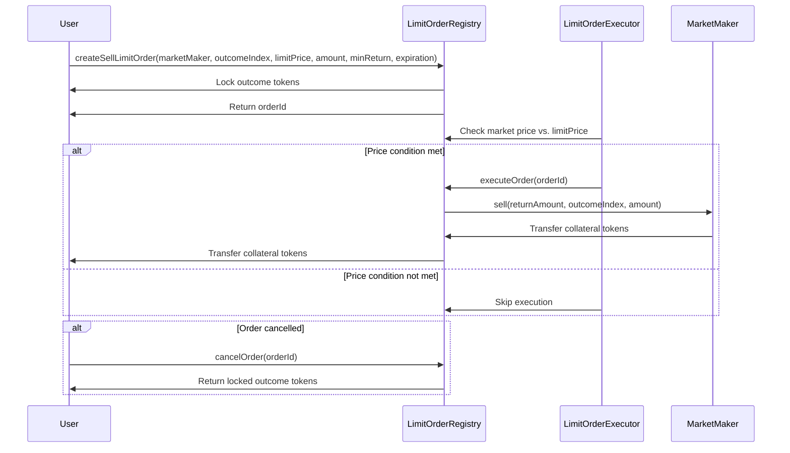

# 条件代币市场做市商系统的限价单设计

## 1. 设计概述

在基于自动做市商(AMM)的条件代币市场中添加限价单功能，结合AMM的流动性优势与传统订单簿的精确交易控制。

### 1.1 核心组件



1. **限价单注册表合约(LimitOrderRegistry)**
   - 管理所有限价单
   - 提供创建、取消和查询功能
   - 锁定用户资产直到执行或取消

2. **限价单执行器(LimitOrderExecutor)**
   - 监控市场价格
   - 在条件满足时执行限价单
   - 支持批量执行以优化gas成本

3. **做市商接口扩展**
   - 扩展现有FixedProductMarketMaker
   - 提供价格查询和池余额检查功能

## 2. 详细设计

### 2.1 限价单注册表合约

```solidity
pragma solidity ^0.5.1;

import { IERC20 } from "openzeppelin-solidity/contracts/token/ERC20/IERC20.sol";
import { ConditionalTokens } from "@gnosis.pm/conditional-tokens-contracts/contracts/ConditionalTokens.sol";
import { FixedProductMarketMaker } from "./FixedProductMarketMaker.sol";

contract LimitOrderRegistry {
    struct LimitOrder {
        address owner;
        FixedProductMarketMaker marketMaker;
        uint outcomeIndex;
        bool isBuyOrder;
        uint limitPrice;  // 以1e18为基准的价格表示
        uint amount;      // 买入或卖出的数量
        uint minReturn;   // 最小返回数量
        uint expiration;  // 过期时间
        bool executed;
        bool cancelled;
    }
    
    mapping(uint => LimitOrder) public orders;
    uint public nextOrderId;
    
    ConditionalTokens public conditionalTokens;
    
    event OrderCreated(uint indexed orderId, address indexed owner, bool isBuyOrder, uint outcomeIndex, uint limitPrice, uint amount);
    event OrderExecuted(uint indexed orderId, uint executedAmount, uint returnAmount);
    event OrderCancelled(uint indexed orderId);
    
    constructor(ConditionalTokens _conditionalTokens) public {
        conditionalTokens = _conditionalTokens;
    }
    
    function createBuyLimitOrder(
        FixedProductMarketMaker _marketMaker,
        uint _outcomeIndex,
        uint _limitPrice,
        uint _amount,
        uint _expiration
    ) external returns (uint orderId) {
        // 检查价格和数量有效性
        require(_limitPrice > 0 && _amount > 0, "Invalid price or amount");
        
        // 计算所需的抵押品金额
        IERC20 collateralToken = _marketMaker.collateralToken();
        
        // 锁定用户抵押品
        require(collateralToken.transferFrom(msg.sender, address(this), _amount), "Collateral transfer failed");
        
        // 为市场做市商授权抵押品
        collateralToken.approve(address(_marketMaker), _amount);
        
        // 创建订单
        orderId = nextOrderId++;
        orders[orderId] = LimitOrder({
            owner: msg.sender,
            marketMaker: _marketMaker,
            outcomeIndex: _outcomeIndex,
            isBuyOrder: true,
            limitPrice: _limitPrice,
            amount: _amount,
            minReturn: 0,  // 在执行时计算
            expiration: _expiration,
            executed: false,
            cancelled: false
        });
        
        emit OrderCreated(orderId, msg.sender, true, _outcomeIndex, _limitPrice, _amount);
        return orderId;
    }
    
    function createSellLimitOrder(
        FixedProductMarketMaker _marketMaker,
        uint _outcomeIndex,
        uint _limitPrice,
        uint _amount,
        uint _minReturn,
        uint _expiration
    ) external returns (uint orderId) {
        // 检查价格和数量有效性
        require(_limitPrice > 0 && _amount > 0, "Invalid price or amount");
        
        // 锁定用户条件代币
        uint positionId = _marketMaker.positionIds(_outcomeIndex);
        conditionalTokens.safeTransferFrom(msg.sender, address(this), positionId, _amount, "");
        
        // 为市场做市商授权条件代币
        conditionalTokens.setApprovalForAll(address(_marketMaker), true);
        
        // 创建订单
        orderId = nextOrderId++;
        orders[orderId] = LimitOrder({
            owner: msg.sender,
            marketMaker: _marketMaker,
            outcomeIndex: _outcomeIndex,
            isBuyOrder: false,
            limitPrice: _limitPrice,
            amount: _amount,
            minReturn: _minReturn,
            expiration: block.timestamp + _expiration,
            executed: false,
            cancelled: false
        });
        
        emit OrderCreated(orderId, msg.sender, false, _outcomeIndex, _limitPrice, _amount);
        return orderId;
    }
    
    function cancelOrder(uint orderId) external {
        LimitOrder storage order = orders[orderId];
        require(order.owner == msg.sender, "Not order owner");
        require(!order.executed && !order.cancelled, "Order already executed or cancelled");
        
        order.cancelled = true;
        
        // 返回锁定的资产
        if (order.isBuyOrder) {
            IERC20 collateralToken = order.marketMaker.collateralToken();
            require(collateralToken.transfer(msg.sender, order.amount), "Collateral return failed");
        } else {
            uint positionId = order.marketMaker.positionIds(order.outcomeIndex);
            conditionalTokens.safeTransferFrom(address(this), msg.sender, positionId, order.amount, "");
        }
        
        emit OrderCancelled(orderId);
    }
    
    function executeOrder(uint orderId) external {
        LimitOrder storage order = orders[orderId];
        require(!order.executed && !order.cancelled, "Order already executed or cancelled");
        require(block.timestamp < order.expiration, "Order expired");
        
        // 检查当前市场价格是否满足限价条件
        uint currentPrice = getCurrentPrice(order.marketMaker, order.outcomeIndex);
        
        if (order.isBuyOrder) {
            require(currentPrice <= order.limitPrice, "Buy price condition not met");
            
            // 计算应该购买的代币数量
            uint outcomeTokensToBuy = order.marketMaker.calcBuyAmount(order.amount, order.outcomeIndex);
            
            // 执行购买
            order.marketMaker.buy(order.amount, order.outcomeIndex, outcomeTokensToBuy);
            
            // 将代币发送给订单创建者
            uint positionId = order.marketMaker.positionIds(order.outcomeIndex);
            conditionalTokens.safeTransferFrom(address(this), order.owner, positionId, outcomeTokensToBuy, "");
            
            emit OrderExecuted(orderId, order.amount, outcomeTokensToBuy);
        } else {
            require(currentPrice >= order.limitPrice, "Sell price condition not met");
            
            // 计算卖出后应返回的抵押品数量
            uint returnAmount = order.marketMaker.calcSellAmount(order.amount, order.outcomeIndex);
            require(returnAmount >= order.minReturn, "Return amount too low");
            
            // 执行卖出
            order.marketMaker.sell(returnAmount, order.outcomeIndex, order.amount);
            
            // 将抵押品发送给订单创建者
            IERC20 collateralToken = order.marketMaker.collateralToken();
            require(collateralToken.transfer(order.owner, returnAmount), "Return transfer failed");
            
            emit OrderExecuted(orderId, order.amount, returnAmount);
        }
        
        order.executed = true;
    }
    
    function getCurrentPrice(FixedProductMarketMaker marketMaker, uint outcomeIndex) public view returns (uint) {
        // 通过查询市场做市商的池余额计算当前价格
        uint[] memory poolBalances = getPoolBalances(marketMaker);
        uint totalBalance = 0;
        
        for (uint i = 0; i < poolBalances.length; i++) {
            totalBalance += poolBalances[i];
        }
        
        // 返回基于当前池余额的边际价格
        return totalBalance > 0 ? (poolBalances[outcomeIndex] * 1e18) / totalBalance : 0;
    }
    
    function getPoolBalances(FixedProductMarketMaker marketMaker) internal view returns (uint[] memory) {
        // 获取市场做市商的池余额
        // 这里简化实现，实际需要调用做市商合约的相应方法
        return marketMaker.getPoolBalances();
    }
}
```

### 2.2 限价单执行器

```solidity
pragma solidity ^0.5.1;

import { LimitOrderRegistry } from "./LimitOrderRegistry.sol";

contract LimitOrderExecutor {
    LimitOrderRegistry public orderRegistry;
    
    constructor(LimitOrderRegistry _orderRegistry) public {
        orderRegistry = _orderRegistry;
    }
    
    // 外部触发函数，检查并执行限价单
    function executeEligibleOrders(uint[] calldata orderIds) external {
        for (uint i = 0; i < orderIds.length; i++) {
            uint orderId = orderIds[i];
            try orderRegistry.executeOrder(orderId) {
                // 成功执行
            } catch {
                // 执行失败，继续下一个
            }
        }
    }
}
```

### 2.3 FixedProductMarketMaker扩展

```solidity
// 在FixedProductMarketMaker.sol中添加
function getPoolBalances() public view returns (uint[] memory) {
    // 实现代码已在合约内部存在，这里只是将其公开为公共函数
    address[] memory thises = new address[](positionIds.length);
    for(uint i = 0; i < positionIds.length; i++) {
        thises[i] = address(this);
    }
    return conditionalTokens.balanceOfBatch(thises, positionIds);
}
```

## 3. 工作流程

### 3.1 买入限价单流程



### 3.2 卖出限价单流程



## 4. 优化与扩展

### 4.1 批量执行功能

```solidity
function executeBatch(uint[] calldata orderIds) external {
    for (uint i = 0; i < orderIds.length; i++) {
        if (isEligibleForExecution(orderIds[i])) {
            executeOrder(orderIds[i]);
        }
    }
}
```

### 4.2 部分执行功能

```solidity
function executePartial(uint orderId, uint partialAmount) external {
    LimitOrder storage order = orders[orderId];
    require(!order.executed && !order.cancelled, "Order already executed or cancelled");
    require(partialAmount > 0 && partialAmount <= order.amount, "Invalid partial amount");
    
    // 实现部分执行逻辑
    // ...
}
```

### 4.3 订单优先级系统

```solidity
struct OrderPriority {
    uint orderId;
    uint priority; // 可基于时间、价格或其他因素
}

function executeWithPriority(uint[] calldata orderIds) external {
    // 对订单进行排序并按优先级执行
    OrderPriority[] memory prioritizedOrders = new OrderPriority[](orderIds.length);
    
    // 填充并排序prioritizedOrders
    // ...
    
    // 按优先级执行订单
    for (uint i = 0; i < prioritizedOrders.length; i++) {
        executeOrder(prioritizedOrders[i].orderId);
    }
}
```

### 4.4 激励机制

为了激励外部执行者触发限价单执行，可以实现激励机制：

```solidity
function executeOrderWithReward(uint orderId) external {
    // 获取当前gas价格
    uint startGas = gasleft();
    
    // 执行订单
    executeOrder(orderId);
    
    // 计算使用的gas
    uint gasUsed = startGas - gasleft();
    
    // 给执行者一定的奖励
    uint reward = calculateReward(gasUsed);
    IERC20 collateralToken = orders[orderId].marketMaker.collateralToken();
    collateralToken.transfer(msg.sender, reward);
}
```

## 5. 挑战与解决方案

### 5.1 价格滑点控制

**挑战**：
在AMM中，大额订单可能导致显著的价格滑点，导致实际执行价格与预期不符。

**解决方案**：
1. 在限价单中加入最大滑点参数
   ```solidity
   function createBuyLimitOrder(..., uint _maxSlippage) external {
       // ...
   }
   ```

2. 大订单分批执行功能
   ```solidity
   function executeLargeOrderInBatches(uint orderId, uint batchSize) external {
       // 将大订单分批执行
   }
   ```

### 5.2 前端运行风险

**挑战**：
限价单执行可能被套利者抢先交易（MEV风险）。

**解决方案**：
1. 最低返回金额保护
   ```solidity
   function executeOrder(uint orderId) external {
       // ...
       require(actualReturn >= minReturn, "Return too low");
       // ...
   }
   ```

2. 使用Flashbots等私有交易渠道
   - 与Flashbots集成，避免公共内存池暴露
   - 实现时间锁定机制

### 5.3 Gas成本优化

**挑战**：
限价单执行可能需要高昂的gas费用。

**解决方案**：
1. 批量执行
   ```solidity
   function executeBatchOptimized(uint[] calldata orderIds) external {
       // 优化的批量执行
   }
   ```

2. Gas费用补偿
   ```solidity
   function calculateGasCompensation(uint gasUsed) internal pure returns (uint) {
       // 根据当前gas价格计算补偿
   }
   ```

## 6. 集成与使用

### 6.1 前端集成

用户界面应该提供以下功能：
- 创建限价单表单（买入/卖出）
- 当前限价单状态监控
- 取消选项
- 市场价格趋势展示

### 6.2 API接口

后端服务应提供：
- 限价单索引
- 市场价格监控
- 执行资格检查
- 自动执行触发器

### 6.3 示例使用场景

**场景1：价格防御策略**
用户想要在市场价格下跌到特定水平时买入：
```javascript
// 前端示例代码
const outcomeIndex = 1; // "Yes"选项
const limitPrice = web3.utils.toWei("0.7"); // 当价格降至0.7时买入
const amount = web3.utils.toWei("10"); // 投入10个抵押品
const expiration = Math.floor(Date.now() / 1000) + 86400; // 24小时过期

// 创建买入限价单
await limitOrderRegistry.methods.createBuyLimitOrder(
    marketMakerAddress,
    outcomeIndex,
    limitPrice,
    amount,
    expiration
).send({ from: userAddress });
```

**场景2：利润锁定策略**
用户持有条件代币，想在价格上涨到特定水平时卖出：
```javascript
// 前端示例代码
const outcomeIndex = 1; // "Yes"选项
const limitPrice = web3.utils.toWei("0.8"); // 当价格升至0.8时卖出
const amount = web3.utils.toWei("100"); // 卖出100个条件代币
const minReturn = web3.utils.toWei("75"); // 最少要得到75个抵押品
const expiration = Math.floor(Date.now() / 1000) + 86400; // 24小时过期

// 创建卖出限价单
await limitOrderRegistry.methods.createSellLimitOrder(
    marketMakerAddress,
    outcomeIndex,
    limitPrice,
    amount,
    minReturn,
    expiration
).send({ from: userAddress });
```

## 7. 测试策略

### 7.1 单元测试

```javascript
contract('LimitOrderRegistry', function([owner, user1, user2]) {
    // 设置测试环境
    
    it('should create buy limit order correctly', async function() {
        // 测试限价买单创建
    });
    
    it('should create sell limit order correctly', async function() {
        // 测试限价卖单创建
    });
    
    it('should execute buy limit order when price condition is met', async function() {
        // 测试限价买单执行
    });
    
    it('should execute sell limit order when price condition is met', async function() {
        // 测试限价卖单执行
    });
    
    it('should allow order cancellation', async function() {
        // 测试订单取消
    });
    
    it('should handle order expiration correctly', async function() {
        // 测试订单过期
    });
});
```

### 7.2 集成测试

```javascript
contract('LimitOrderSystem', function([owner, user1, user2]) {
    // 设置完整系统测试环境
    
    it('should correctly integrate with FixedProductMarketMaker', async function() {
        // 测试与做市商集成
    });
    
    it('should correctly handle market price changes', async function() {
        // 测试市场价格变化对限价单的影响
    });
    
    it('should execute multiple orders in batch', async function() {
        // 测试批量执行
    });
});
```

## 8. 总结

本设计通过添加限价单功能，显著增强了条件代币市场的功能性和用户体验。它结合了AMM的流动性优势和传统订单簿的精确交易控制，为用户提供了更多交易策略选择。

主要优势包括：
- 允许用户设置特定价格条件的交易
- 实现自动化交易执行
- 提供价格防御和利润锁定机制
- 保持系统的去中心化特性

后续可考虑的扩展：
- 更复杂的交易类型（如止损单、追踪止损单）
- 具有时间条件的交易策略
- 基于链上预言机的条件执行
- 与Layer 2解决方案集成以降低gas成本

通过这些改进，条件代币市场将更加灵活，能够满足更广泛的用户需求，同时保持去中心化预测市场的核心价值。