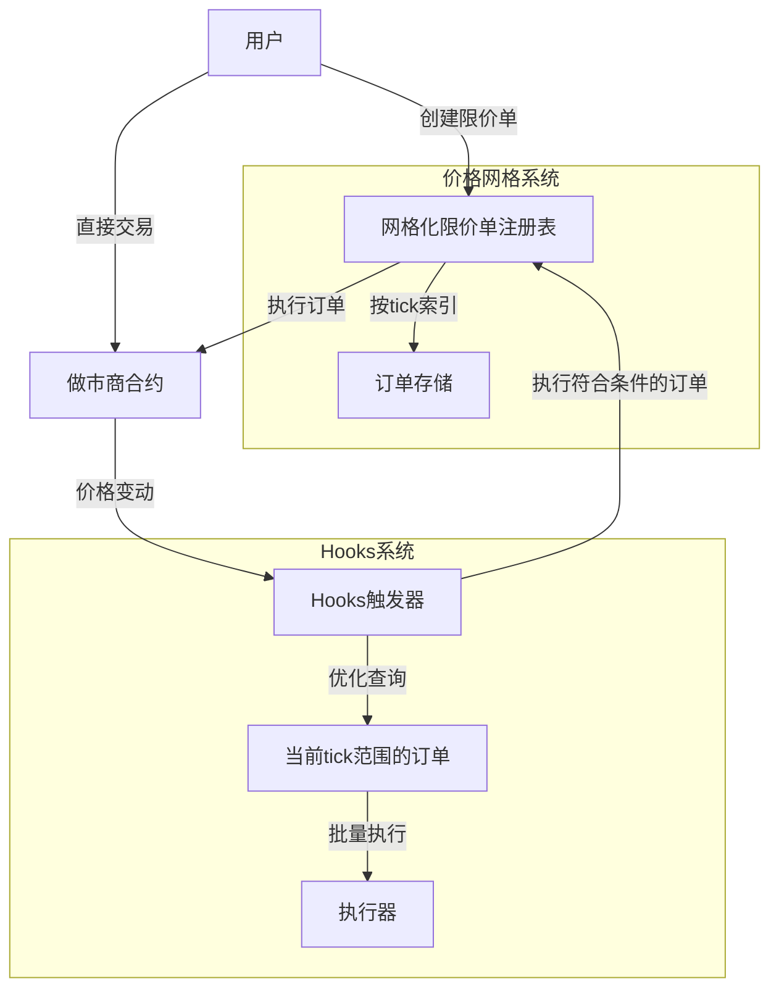
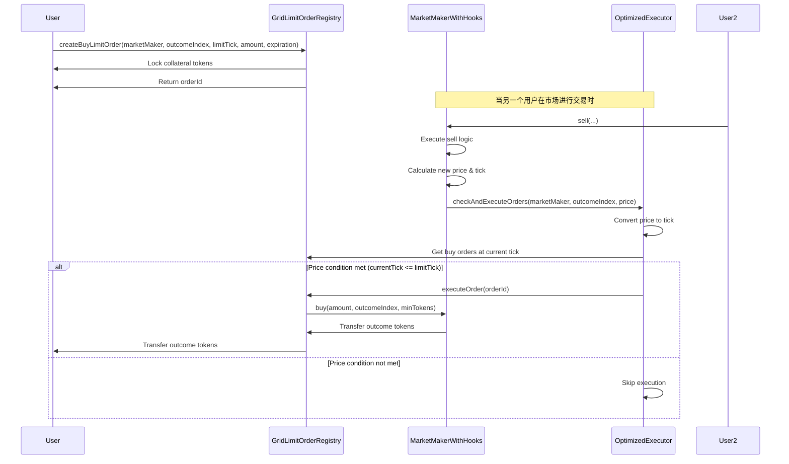
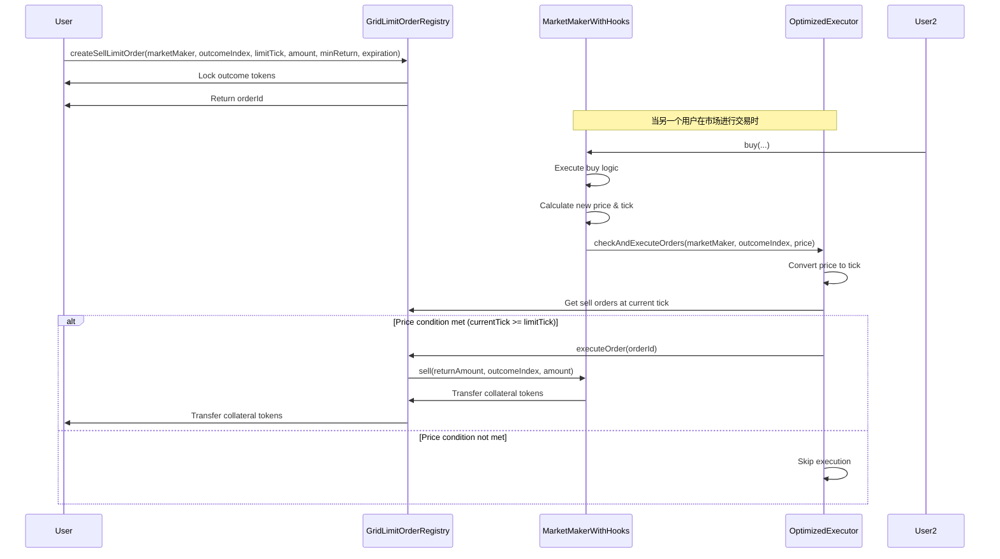

# 条件代币市场做市商系统的优化限价单设计

本文档描述了对基础限价单设计的两项重要优化：价格网格化和Hooks系统，旨在解决原始设计中的滑点和gas成本问题。

## 1. 设计概述

在原始限价单设计的基础上，我们引入了两个核心优化：

1. **价格网格化**：类似Uniswap v3的tick系统，将价格空间离散化为固定的价格点
2. **Hooks系统**：在市场交易后自动触发限价单执行，减少单独交易的gas成本



## 2. 价格网格化设计

### 2.1 tick系统

类似Uniswap v3，我们使用离散的价格点（ticks）来表示价格，每个tick代表一个特定的价格水平。

```solidity
// 定义价格点系统
contract TickSystem {
    // 定义最小价格变动单位
    int24 public constant TICK_SPACING = 10;  // 使用较小间距以适应预测市场
    int24 public constant MIN_TICK = -887272;
    int24 public constant MAX_TICK = 887272;
    
    // 价格与tick的转换函数
    function tickToPrice(int24 tick) public pure returns (uint256) {
        return FixedPoint96.Q96 * uint256(1.0001 ** tick);
    }
    
    function priceToTick(uint256 price) public pure returns (int24) {
        return int24(log1.0001(price / FixedPoint96.Q96));
    }
    
    // 确保tick在有效范围内且符合spacing
    function validateTick(int24 tick) public pure returns (int24) {
        require(tick >= MIN_TICK && tick <= MAX_TICK, "Tick out of range");
        int24 tickSpacingMultiple = tick / TICK_SPACING;
        return tickSpacingMultiple * TICK_SPACING;
    }
}
```

### 2.2 网格化限价单注册表

订单现在按tick组织，而不是简单地按价格排序：

```solidity
pragma solidity ^0.5.1;

import { TickSystem } from "./TickSystem.sol";
import { IERC20 } from "openzeppelin-solidity/contracts/token/ERC20/IERC20.sol";
import { ConditionalTokens } from "@gnosis.pm/conditional-tokens-contracts/contracts/ConditionalTokens.sol";
import { FixedProductMarketMaker } from "./FixedProductMarketMaker.sol";

contract GridLimitOrderRegistry is TickSystem {
    struct GridLimitOrder {
        address owner;
        FixedProductMarketMaker marketMaker;
        uint outcomeIndex;
        bool isBuyOrder;
        int24 limitTick;  // 使用tick表示价格而非绝对价格
        uint amount;
        uint minReturn;
        uint expiration;
        bool executed;
        bool cancelled;
    }
    
    mapping(uint => GridLimitOrder) public orders;
    uint public nextOrderId;
    
    // 按市场、结果和tick索引订单
    mapping(address => mapping(uint => mapping(int24 => uint[]))) public buyOrdersByTick;
    mapping(address => mapping(uint => mapping(int24 => uint[]))) public sellOrdersByTick;
    
    ConditionalTokens public conditionalTokens;
    
    event OrderCreated(uint indexed orderId, address indexed owner, bool isBuyOrder, uint outcomeIndex, int24 limitTick, uint amount);
    event OrderExecuted(uint indexed orderId, uint executedAmount, uint returnAmount);
    event OrderCancelled(uint indexed orderId);
    
    constructor(ConditionalTokens _conditionalTokens) public {
        conditionalTokens = _conditionalTokens;
    }
    
    function createBuyLimitOrder(
        FixedProductMarketMaker _marketMaker,
        uint _outcomeIndex,
        int24 _limitTick,
        uint _amount,
        uint _expiration
    ) external returns (uint orderId) {
        // 验证并规范化tick
        int24 limitTick = validateTick(_limitTick);
        
        // 检查数量有效性
        require(_amount > 0, "Invalid amount");
        
        // 计算所需的抵押品金额
        IERC20 collateralToken = _marketMaker.collateralToken();
        
        // 锁定用户抵押品
        require(collateralToken.transferFrom(msg.sender, address(this), _amount), "Collateral transfer failed");
        
        // 为市场做市商授权抵押品
        collateralToken.approve(address(_marketMaker), _amount);
        
        // 创建订单
        orderId = nextOrderId++;
        orders[orderId] = GridLimitOrder({
            owner: msg.sender,
            marketMaker: _marketMaker,
            outcomeIndex: _outcomeIndex,
            isBuyOrder: true,
            limitTick: limitTick,
            amount: _amount,
            minReturn: 0,
            expiration: _expiration,
            executed: false,
            cancelled: false
        });
        
        // 按tick索引订单
        buyOrdersByTick[address(_marketMaker)][_outcomeIndex][limitTick].push(orderId);
        
        emit OrderCreated(orderId, msg.sender, true, _outcomeIndex, limitTick, _amount);
        return orderId;
    }
    
    function createSellLimitOrder(
        FixedProductMarketMaker _marketMaker,
        uint _outcomeIndex,
        int24 _limitTick,
        uint _amount,
        uint _minReturn,
        uint _expiration
    ) external returns (uint orderId) {
        // 验证并规范化tick
        int24 limitTick = validateTick(_limitTick);
        
        // 检查数量有效性
        require(_amount > 0, "Invalid amount");
        
        // 锁定用户条件代币
        uint positionId = _marketMaker.positionIds(_outcomeIndex);
        conditionalTokens.safeTransferFrom(msg.sender, address(this), positionId, _amount, "");
        
        // 为市场做市商授权条件代币
        conditionalTokens.setApprovalForAll(address(_marketMaker), true);
        
        // 创建订单
        orderId = nextOrderId++;
        orders[orderId] = GridLimitOrder({
            owner: msg.sender,
            marketMaker: _marketMaker,
            outcomeIndex: _outcomeIndex,
            isBuyOrder: false,
            limitTick: limitTick,
            amount: _amount,
            minReturn: _minReturn,
            expiration: block.timestamp + _expiration,
            executed: false,
            cancelled: false
        });
        
        // 按tick索引订单
        sellOrdersByTick[address(_marketMaker)][_outcomeIndex][limitTick].push(orderId);
        
        emit OrderCreated(orderId, msg.sender, false, _outcomeIndex, limitTick, _amount);
        return orderId;
    }
    
    function cancelOrder(uint orderId) external {
        GridLimitOrder storage order = orders[orderId];
        require(order.owner == msg.sender, "Not order owner");
        require(!order.executed && !order.cancelled, "Order already executed or cancelled");
        
        order.cancelled = true;
        
        // 从tick索引中移除订单（简化版本，实际实现可能需要更复杂的逻辑）
        if (order.isBuyOrder) {
            // 从buyOrdersByTick中移除
            removeOrderFromTickIndex(
                buyOrdersByTick[address(order.marketMaker)][order.outcomeIndex][order.limitTick], 
                orderId
            );
        } else {
            // 从sellOrdersByTick中移除
            removeOrderFromTickIndex(
                sellOrdersByTick[address(order.marketMaker)][order.outcomeIndex][order.limitTick], 
                orderId
            );
        }
        
        // 返回锁定的资产
        if (order.isBuyOrder) {
            IERC20 collateralToken = order.marketMaker.collateralToken();
            require(collateralToken.transfer(msg.sender, order.amount), "Collateral return failed");
        } else {
            uint positionId = order.marketMaker.positionIds(order.outcomeIndex);
            conditionalTokens.safeTransferFrom(address(this), msg.sender, positionId, order.amount, "");
        }
        
        emit OrderCancelled(orderId);
    }
    
    // 帮助函数，从tick索引数组中移除订单ID
    function removeOrderFromTickIndex(uint[] storage orderIds, uint orderId) internal {
        for (uint i = 0; i < orderIds.length; i++) {
            if (orderIds[i] == orderId) {
                // 用最后一个元素替换当前元素，然后删除最后一个元素
                orderIds[i] = orderIds[orderIds.length - 1];
                orderIds.pop();
                break;
            }
        }
    }
    
    function executeOrder(uint orderId) external {
        GridLimitOrder storage order = orders[orderId];
        require(!order.executed && !order.cancelled, "Order already executed or cancelled");
        require(block.timestamp < order.expiration, "Order expired");
        
        // 执行订单的逻辑与原始版本类似，但使用tick比较价格
        uint currentPrice = getCurrentPrice(order.marketMaker, order.outcomeIndex);
        int24 currentTick = priceToTick(currentPrice);
        
        if (order.isBuyOrder) {
            // 买单: 当前tick必须小于等于限价tick
            require(currentTick <= order.limitTick, "Buy price condition not met");
            
            // 执行买入逻辑
            // ...
        } else {
            // 卖单: 当前tick必须大于等于限价tick
            require(currentTick >= order.limitTick, "Sell price condition not met");
            
            // 执行卖出逻辑
            // ...
        }
        
        order.executed = true;
        
        // 从tick索引中移除已执行的订单
        // ...
    }
    
    // 获取特定tick处的买单
    function getBuyOrdersAtTick(address marketMaker, uint outcomeIndex, int24 tick) 
        external view returns (uint[] memory) {
        return buyOrdersByTick[marketMaker][outcomeIndex][tick];
    }
    
    // 获取特定tick处的卖单
    function getSellOrdersAtTick(address marketMaker, uint outcomeIndex, int24 tick) 
        external view returns (uint[] memory) {
        return sellOrdersByTick[marketMaker][outcomeIndex][tick];
    }
    
    // 获取当前市场价格（实现略）
    function getCurrentPrice(FixedProductMarketMaker marketMaker, uint outcomeIndex) 
        public view returns (uint) {
        // ...
    }
}
```

### 2.3 价格区间订单

除了单点限价单外，我们还可以引入价格区间订单，类似Uniswap v3的区间流动性：

```solidity
function createRangeOrder(
    FixedProductMarketMaker _marketMaker,
    uint _outcomeIndex,
    int24 _lowerTick,
    int24 _upperTick,
    uint _amount
) external returns (uint orderId) {
    // 验证tick范围
    int24 lowerTick = validateTick(_lowerTick);
    int24 upperTick = validateTick(_upperTick);
    require(lowerTick < upperTick, "Invalid tick range");
    
    // 创建区间订单的逻辑
    // ...
}
```

## 3. Hooks系统设计

### 3.1 做市商合约的Hooks扩展

```solidity
pragma solidity ^0.5.1;

import { FixedProductMarketMaker } from "./FixedProductMarketMaker.sol";

interface ILimitOrderExecutor {
    function checkAndExecuteOrders(address marketMaker, uint outcomeIndex, uint price) external;
}

contract FixedProductMarketMakerWithHooks is FixedProductMarketMaker {
    ILimitOrderExecutor public limitOrderExecutor;
    
    // 构造函数在初始化时不设置执行器，允许后续设置
    constructor(
        ConditionalTokens _conditionalTokens,
        IERC20 _collateralToken,
        bytes32[] memory _conditionIds,
        uint _fee
    ) FixedProductMarketMaker(_conditionalTokens, _collateralToken, _conditionIds, _fee) public {
    }
    
    // 设置限价单执行器地址
    function setLimitOrderExecutor(ILimitOrderExecutor _executor) external onlyOwner {
        limitOrderExecutor = _executor;
    }
    
    // 在交易后触发Hooks
    function _afterTrade(uint outcomeIndex, uint newPrice) internal {
        // 如果已设置执行器，尝试执行符合条件的订单
        if (address(limitOrderExecutor) != address(0)) {
            // 使用try-catch避免执行器失败影响主要交易
            try limitOrderExecutor.checkAndExecuteOrders(address(this), outcomeIndex, newPrice) {
                // 成功执行，不做特殊处理
            } catch {
                // 即使执行器失败，也不影响主要交易
            }
        }
    }
    
    // 计算当前价格
    function calculateCurrentPrice(uint outcomeIndex) public view returns (uint) {
        uint[] memory poolBalances = getPoolBalances();
        uint totalBalance = 0;
        
        for (uint i = 0; i < poolBalances.length; i++) {
            totalBalance += poolBalances[i];
        }
        
        return totalBalance > 0 ? (poolBalances[outcomeIndex] * 1e18) / totalBalance : 0;
    }
    
    // 重写buy函数
    function buy(uint investmentAmount, uint outcomeIndex, uint minOutcomeTokensToBuy) external {
        // 调用原始buy逻辑
        super.buy(investmentAmount, outcomeIndex, minOutcomeTokensToBuy);
        
        // 计算新价格
        uint newPrice = calculateCurrentPrice(outcomeIndex);
        
        // 触发hooks
        _afterTrade(outcomeIndex, newPrice);
    }
    
    // 重写sell函数
    function sell(uint returnAmount, uint outcomeIndex, uint maxOutcomeTokensToSell) external {
        // 调用原始sell逻辑
        super.sell(returnAmount, outcomeIndex, maxOutcomeTokensToSell);
        
        // 计算新价格
        uint newPrice = calculateCurrentPrice(outcomeIndex);
        
        // 触发hooks
        _afterTrade(outcomeIndex, newPrice);
    }
}
```

### 3.2 优化的限价单执行器

执行器现在可以直接从市场做市商获取回调，而不需要外部触发：

```solidity
pragma solidity ^0.5.1;

import { ILimitOrderExecutor } from "./ILimitOrderExecutor.sol";
import { GridLimitOrderRegistry } from "./GridLimitOrderRegistry.sol";
import { TickSystem } from "./TickSystem.sol";

contract OptimizedLimitOrderExecutor is ILimitOrderExecutor, TickSystem {
    GridLimitOrderRegistry public orderRegistry;
    
    // 设置每次执行检查的tick范围
    int24 public constant LOOKUP_RANGE = 50;
    
    // 记录已检查的价格区间，避免重复执行
    mapping(address => mapping(uint => mapping(int24 => bool))) public checkedTicks;
    
    constructor(GridLimitOrderRegistry _registry) public {
        orderRegistry = _registry;
    }
    
    function checkAndExecuteOrders(address marketMaker, uint outcomeIndex, uint price) external override {
        // 只允许做市商合约调用
        require(msg.sender == marketMaker, "Unauthorized caller");
        
        // 转换价格为tick
        int24 currentTick = priceToTick(price);
        
        // 执行符合条件的买单（当前价格低于或等于限价）
        _executeBuyOrders(marketMaker, outcomeIndex, currentTick);
        
        // 执行符合条件的卖单（当前价格高于或等于限价）
        _executeSellOrders(marketMaker, outcomeIndex, currentTick);
    }
    
    // 执行符合条件的买单
    function _executeBuyOrders(address marketMaker, uint outcomeIndex, int24 currentTick) internal {
        // 检查当前tick及以上的买单
        for (int24 tick = currentTick; tick <= currentTick + LOOKUP_RANGE; tick += TICK_SPACING) {
            if (!checkedTicks[marketMaker][outcomeIndex][tick]) {
                uint[] memory orderIds = orderRegistry.getBuyOrdersAtTick(marketMaker, outcomeIndex, tick);
                for (uint i = 0; i < orderIds.length; i++) {
                    try orderRegistry.executeOrder(orderIds[i]) {
                        // 成功执行
                    } catch {
                        // 执行失败，继续下一个
                    }
                }
                checkedTicks[marketMaker][outcomeIndex][tick] = true;
            }
        }
    }
    
    // 执行符合条件的卖单
    function _executeSellOrders(address marketMaker, uint outcomeIndex, int24 currentTick) internal {
        // 检查当前tick及以下的卖单
        for (int24 tick = currentTick; tick >= currentTick - LOOKUP_RANGE; tick -= TICK_SPACING) {
            if (!checkedTicks[marketMaker][outcomeIndex][tick]) {
                uint[] memory orderIds = orderRegistry.getSellOrdersAtTick(marketMaker, outcomeIndex, tick);
                for (uint i = 0; i < orderIds.length; i++) {
                    try orderRegistry.executeOrder(orderIds[i]) {
                        // 成功执行
                    } catch {
                        // 执行失败，继续下一个
                    }
                }
                checkedTicks[marketMaker][outcomeIndex][tick] = true;
            }
        }
    }
    
    // 重置已检查的ticks，当市场波动较大或长时间未执行时调用
    function resetCheckedTicks(address marketMaker, uint outcomeIndex, int24 fromTick, int24 toTick) external {
        require(fromTick <= toTick, "Invalid tick range");
        
        for (int24 tick = fromTick; tick <= toTick; tick += TICK_SPACING) {
            checkedTicks[marketMaker][outcomeIndex][tick] = false;
        }
    }
}
```

## 4. 工作流程

### 4.1 网格化买入限价单流程



### 4.2 网格化卖出限价单流程



## 5. 优势与挑战

### 5.1 价格网格化的优势

1. **更高的价格精度**
   - 用户可以设置精确的价格点，减少滑点
   - 订单按tick分组，提高查询和执行效率

2. **资本效率提升**
   - 流动性集中在活跃价格区间
   - 避免资金分散到不太可能达到的价格点

3. **增强的订单管理**
   - 更容易找到满足条件的订单
   - 优化执行顺序，让更接近市场价格的订单优先执行

### 5.2 Hooks系统的优势

1. **降低gas成本**
   - 订单执行成为交易的副作用，不需要单独交易
   - 批量执行多个订单，摊销gas成本

2. **更及时的执行**
   - 订单在条件满足后立即执行
   - 无需依赖外部keeper或执行者

3. **改善用户体验**
   - 用户不需要额外支付执行费用
   - 订单执行更可预测，不会错过交易机会

### 5.3 实施挑战

1. **复杂性增加**
   - 系统复杂度显著增加，需要更多的测试和审计
   - 智能合约升级需要考虑兼容性问题

2. **gas成本优化**
   - hooks执行中需要限制gas消耗
   - 平衡检查范围和gas消耗

3. **异常处理**
   - 需要妥善处理执行失败的情况
   - 防止单个订单失败影响整个交易

## 6. 实施路线图

1. **阶段1：基础实现**
   - 实现TickSystem基础功能
   - 开发GridLimitOrderRegistry的核心功能
   - 添加基本的订单创建和执行逻辑

2. **阶段2：Hooks集成**
   - 扩展FixedProductMarketMaker添加hooks
   - 实现优化的执行器
   - 连接做市商和执行器

3. **阶段3：优化与扩展**
   - 添加价格区间订单功能
   - 优化gas消耗
   - 实现高级订单类型（如阶梯订单）

4. **阶段4：测试与部署**
   - 全面测试系统在各种市场情况下的表现
   - 安全审计
   - 分阶段部署和监控

## 7. 示例用法

### 7.1 创建基于tick的限价单

```javascript
// 前端示例代码
const outcomeIndex = 1; // "Yes"选项
const limitPrice = web3.utils.toWei("0.7"); 
const limitTick = await tickSystem.priceToTick(limitPrice); // 转换价格为tick
const amount = web3.utils.toWei("10");
const expiration = Math.floor(Date.now() / 1000) + 86400; // 24小时过期

// 创建买入限价单
await gridLimitOrderRegistry.methods.createBuyLimitOrder(
    marketMakerAddress,
    outcomeIndex,
    limitTick,
    amount,
    expiration
).send({ from: userAddress });
```

### 7.2 创建价格区间订单

```javascript
// 前端示例代码
const outcomeIndex = 1; // "Yes"选项
const lowerPrice = web3.utils.toWei("0.6");
const upperPrice = web3.utils.toWei("0.8");
const lowerTick = await tickSystem.priceToTick(lowerPrice);
const upperTick = await tickSystem.priceToTick(upperPrice);
const amount = web3.utils.toWei("10");

// 创建价格区间订单
await gridLimitOrderRegistry.methods.createRangeOrder(
    marketMakerAddress,
    outcomeIndex,
    lowerTick,
    upperTick,
    amount
).send({ from: userAddress });
```

## 8. 结论

通过引入价格网格化和Hooks系统，我们显著提升了限价单系统的性能和用户体验：

1. **价格网格化**解决了滑点问题，通过离散化价格空间，提供更精确的价格控制和更高效的订单管理。

2. **Hooks系统**解决了gas成本高的问题，通过在交易过程中自动触发订单执行，减少了额外交易的需求，并允许批量订单执行。

这些优化不仅提高了系统效率，也带来了更好的用户体验，使得条件代币市场的交易机制更接近传统中心化交易所的性能和功能，同时保持了去中心化的优势。

未来，这一系统还可以进一步扩展，支持更复杂的订单类型和交易策略，为条件代币市场带来更丰富的交易可能性。 