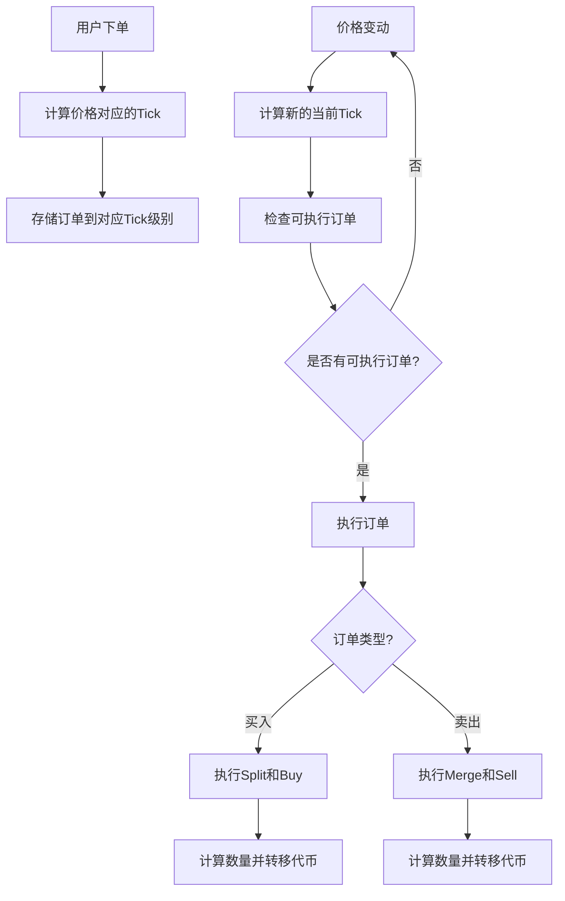

# Conditional Token的Split/Merge与Tick系统集成方案

## 1. 问题背景

在条件代币市场中，我们面临一个重要的架构挑战：结合Conditional Token合约原生的Split/Merge机制与新引入的基于Uniswap V4的Tick系统。这两个系统在设计理念和操作方式上存在较大差异：

- **Conditional Token系统**：采用Split操作将抵押品转换为结果代币，Merge操作将结果代币转回抵押品，通过ERC1155标准管理多种结果代币
- **Tick系统**：基于离散价格点（tick）管理订单，主要设计用于ERC20代币之间的交换

这种差异导致在限价单实现过程中需要特殊考虑数量计算和价格定义的问题。

## 2. 核心挑战点

### 2.1 Conditional Token的数量计算机制

在Conditional Token系统中，当用户执行Split操作时：

```solidity
// 简化的Split操作逻辑
function splitPosition(
    IERC20 collateralToken,
    bytes32 conditionId,
    uint[] calldata partition,
    uint amount
) external {
    // 锁定用户的抵押品
    require(collateralToken.transferFrom(msg.sender, address(this), amount), "Transfer failed");
    
    // 为每个结果铸造对应的条件代币
    for (uint i = 0; i < partition.length; i++) {
        uint positionId = calculatePositionId(collateralToken, conditionId, partition[i]);
        _mint(msg.sender, positionId, amount, "");
    }
    
    // 触发事件
    emit PositionSplit(msg.sender, collateralToken, conditionId, partition, amount);
}
```

而Merge操作则相反：

```solidity
// 简化的Merge操作逻辑
function mergePositions(
    IERC20 collateralToken,
    bytes32 conditionId,
    uint[] calldata partition,
    uint amount
) external {
    // 销毁用户的条件代币
    for (uint i = 0; i < partition.length; i++) {
        uint positionId = calculatePositionId(collateralToken, conditionId, partition[i]);
        _burn(msg.sender, positionId, amount);
    }
    
    // 释放抵押品给用户
    require(collateralToken.transfer(msg.sender, amount), "Transfer failed");
    
    // 触发事件
    emit PositionsMerge(msg.sender, collateralToken, conditionId, partition, amount);
}
```

### 2.2 Tick系统的价格定义

Tick系统使用离散的价格点表示价格，每个tick对应一个特定的价格：

```solidity
// Tick到价格的转换
function tickToPrice(int24 tick) internal pure returns (uint256) {
    return uint256(1.0001 ** tick) * 10**18 / 2**96;
}

// 价格到Tick的转换
function priceToTick(uint256 price) internal pure returns (int24) {
    return int24(log1.0001(price * 2**96 / 10**18));
}
```

## 3. 集成方案

为了协调这两种系统，我们提出以下集成方案：

### 3.1 价格与数量的处理流程

1. **价格表示统一**：所有价格以18位小数表示，便于与Tick系统互转
2. **Split/Merge与Tick的桥接**：在订单执行时动态计算需要Split或Merge的代币数量
3. **价格边界条件处理**：限价单执行时考虑价格边界和Tick间隔的影响



### 3.2 买入限价单执行流程

当用户设置买入限价单时，系统需要在价格满足条件时执行Split和Buy操作：

```solidity
// 买入限价单执行
function executeBuyLimitOrder(
    uint orderId,
    address marketMaker,
    uint currentTick
) internal {
    Order storage order = orders[orderId];
    
    // 1. 验证价格条件（当前tick <= 订单tick）
    require(currentTick <= order.limitTick, "Price condition not met");
    
    // 2. 计算当前实际价格（基于tick）
    uint currentPrice = TickMath.tickToPrice(currentTick);
    
    // 3. 计算预期获得的结果代币数量（考虑18位小数）
    uint expectedTokens = order.amount * ONE / currentPrice;
    
    // 4. 设置最小接收数量（滑点保护）
    uint minTokens = expectedTokens * 99 / 100;
    
    // 5. 执行买入操作
    // 注意：这里内部会处理Split逻辑
    uint outcomeTokensBought = IHookableFixedProductMarketMaker(marketMaker).buy(
        order.amount,  // 抵押品金额
        order.outcomeIndex,
        minTokens
    );
    
    // 6. 转移结果代币给用户
    uint positionId = positionIdByMarketAndOutcome[marketMaker][order.outcomeIndex];
    conditionalTokens.safeTransferFrom(
        address(this),
        order.owner,
        positionId,
        outcomeTokensBought,
        ""
    );
    
    // 7. 更新订单状态
    order.filled = order.amount;
    order.active = false;
    
    // 8. 从活跃订单列表移除
    removeOrderFromTick(marketMaker, order.outcomeIndex, order.limitTick, orderId, true);
    
    // 9. 触发事件
    emit OrderExecuted(orderId, outcomeTokensBought, currentPrice);
}
```

在FixedProductMarketMaker中的buy操作内部会处理Split逻辑：

```solidity
// FixedProductMarketMaker中的buy实现（简化版）
function buy(uint investmentAmount, uint outcomeIndex, uint minOutcomeTokens) public returns (uint) {
    // 1. 转移抵押品到市场合约
    require(collateralToken.transferFrom(msg.sender, address(this), investmentAmount), "Transfer failed");
    
    // 2. 计算可获得的结果代币数量
    uint outcomeTokenCount = calcBuyAmount(investmentAmount, outcomeIndex);
    require(outcomeTokenCount >= minOutcomeTokens, "Slippage limit hit");
    
    // 3. 内部执行Split操作
    splitInvestmentAmount(investmentAmount);
    
    // 4. 更新市场状态
    uint[] memory positionIds = conditionalTokens.getPositionIds(collateralToken, bytes32(0), outcomeIndex);
    conditionalTokens.safeTransferFrom(address(this), msg.sender, positionIds[0], outcomeTokenCount, "");
    
    // 5. 返回实际获得的结果代币数量
    return outcomeTokenCount;
}

// 内部执行Split操作
function splitInvestmentAmount(uint investmentAmount) internal {
    // 为给定条件执行Split操作
    conditionalTokens.splitPosition(
        collateralToken,
        conditionId,
        partition, // 结果集合
        investmentAmount
    );
}
```

### 3.3 卖出限价单执行流程

对于卖出限价单，则需要执行Merge和Sell操作：

```solidity
// 卖出限价单执行
function executeSellLimitOrder(
    uint orderId,
    address marketMaker,
    uint currentTick
) internal {
    Order storage order = orders[orderId];
    
    // 1. 验证价格条件（当前tick >= 订单tick，因为卖出是希望价格更高）
    require(currentTick >= order.limitTick, "Price condition not met");
    
    // 2. 获取当前实际价格
    uint currentPrice = TickMath.tickToPrice(currentTick);
    
    // 3. 计算预期获得的抵押品金额
    uint expectedCollateral = order.amount * currentPrice / ONE;
    
    // 4. 设置最小接收金额（滑点保护）
    uint minCollateral = expectedCollateral * 99 / 100;
    
    // 5. 执行卖出操作前的准备（可能需要Merge）
    uint positionId = positionIdByMarketAndOutcome[marketMaker][order.outcomeIndex];
    prepareSellOrderExecution(marketMaker, positionId, order.amount);
    
    // 6. 授权市场合约使用代币
    conditionalTokens.setApprovalForAll(marketMaker, true);
    
    // 7. 执行卖出操作
    uint returnAmount = IHookableFixedProductMarketMaker(marketMaker).sell(
        order.amount,
        order.outcomeIndex,
        minCollateral
    );
    
    // 8. 转移抵押品给用户
    IERC20 collateralToken = IERC20(IHookableFixedProductMarketMaker(marketMaker).collateralToken());
    require(collateralToken.transfer(order.owner, returnAmount), "Transfer failed");
    
    // 9. 更新订单状态
    order.filled = order.amount;
    order.active = false;
    
    // 10. 从活跃订单列表移除
    removeOrderFromTick(marketMaker, order.outcomeIndex, order.limitTick, orderId, false);
    
    // 11. 触发事件
    emit OrderExecuted(orderId, returnAmount, currentPrice);
}

// 准备卖出操作（处理Merge需求）
function prepareSellOrderExecution(address marketMaker, uint positionId, uint amount) internal {
    IHookableFixedProductMarketMaker market = IHookableFixedProductMarketMaker(marketMaker);
    
    // 检查是否需要进行Merge操作（多条件市场的情况）
    if (market.isMultipleConditions()) {
        // 获取条件ID和分区信息
        bytes32[] memory conditionIds = market.getConditionIds();
        // 执行Merge逻辑
        // ...
    }
}
```

### 3.4 价格/数量计算中需要考虑的特殊情况

1. **多条件市场**：当市场包含多个条件时，需要正确处理复杂的Split/Merge路径

2. **精度和舍入**：处理小数计算时需要正确处理舍入，避免舍入误差累积

3. **零流动性情况**：当某个结果代币池接近零流动性时的边界处理

4. **价格跳跃**：价格在Tick之间跳跃时，需要正确处理被跳过的Tick上的订单

```solidity
// 处理价格跳跃的情况
function handlePriceJump(
    address marketMaker,
    uint outcomeIndex,
    int24 oldTick,
    int24 newTick
) internal {
    // 确定遍历方向
    bool isIncreasing = newTick > oldTick;
    
    int24 startTick = isIncreasing ? oldTick : newTick;
    int24 endTick = isIncreasing ? newTick : oldTick;
    
    // 遍历所有被跳过的tick
    for (int24 tick = startTick; tick <= endTick; tick += TickMath.TICK_SPACING) {
        // 对于增长的价格，执行买单
        if (isIncreasing) {
            executeAllBuyOrdersAtTick(marketMaker, outcomeIndex, tick);
        } 
        // 对于下降的价格，执行卖单
        else {
            executeAllSellOrdersAtTick(marketMaker, outcomeIndex, tick);
        }
    }
}
```

## 4. 数据结构与接口设计

### 4.1 订单存储结构

```solidity
// 订单结构
struct Order {
    address owner;          // 订单所有者
    address marketMaker;    // 市场合约地址
    uint outcomeIndex;      // 结果索引
    uint price;             // 价格（18位小数表示）
    int24 limitTick;        // 对应的tick值
    uint amount;            // 订单金额（18位小数表示）
    uint minReturnAmount;   // 最小返回金额
    uint expiration;        // 过期时间
    bool active;            // 是否活跃
    uint filled;            // 已成交金额
}

// 按Tick存储订单
mapping(address => mapping(uint => mapping(int24 => uint[]))) public buyOrdersByTick;  // 市场 => 结果 => tick => 订单ID数组
mapping(address => mapping(uint => mapping(int24 => uint[]))) public sellOrdersByTick; // 市场 => 结果 => tick => 订单ID数组
```

### 4.2 接口设计

```solidity
// LimitOrderHook接口
interface ILimitOrderHook is IMarketHook, ERC1155TokenReceiver {
    // 下买单
    function placeBuyLimitOrder(
        address marketMaker,
        uint outcomeIndex,
        uint price,  // 18位小数表示
        uint amount, // 18位小数表示
        uint expiration
    ) external returns (uint orderId);
    
    // 下卖单
    function placeSellLimitOrder(
        address marketMaker,
        uint outcomeIndex,
        uint price,  // 18位小数表示
        uint amount, // 18位小数表示
        uint minReturnAmount,
        uint expiration
    ) external returns (uint orderId);
    
    // 取消订单
    function cancelOrder(uint orderId) external;
    
    // 更新价格触发订单执行检查
    function checkAndExecuteOrders(
        address marketMaker,
        uint outcomeIndex,
        int24 oldTick,
        int24 newTick
    ) external;
}
```

### 4.3 与FixedProductMarketMaker的集成

```solidity
// 扩展的市场接口
interface IHookableFixedProductMarketMaker {
    // 现有方法
    function buy(uint investmentAmount, uint outcomeIndex, uint minOutcomeTokens) external returns (uint);
    function sell(uint returnAmount, uint outcomeIndex, uint minReturnAmount) external returns (uint);
    
    // 新增方法
    function getPositionIds() external view returns (uint[] memory);
    function calculateOutcomePrice(uint outcomeIndex) external view returns (uint);
    function getCurrentTick(uint outcomeIndex) external view returns (int24);
    function collateralToken() external view returns (address);
    function getConditionIds() external view returns (bytes32[] memory);
    function isMultipleConditions() external view returns (bool);
}
```

## 5. 实现要点与优化思路

### 5.1 批量处理优化

为提高gas效率，可以批量处理同一Tick区间内的订单：

```solidity
// 批量执行特定Tick上的所有买入订单
function executeAllBuyOrdersAtTick(
    address marketMaker,
    uint outcomeIndex,
    int24 tick
) internal {
    uint[] storage orderIds = buyOrdersByTick[marketMaker][outcomeIndex][tick];
    if (orderIds.length == 0) return;
    
    // 收集需要处理的订单
    uint[] memory validOrderIds = new uint[](orderIds.length);
    uint validCount = 0;
    
    for (uint i = 0; i < orderIds.length; i++) {
        if (orders[orderIds[i]].active && !hasExpired(orderIds[i])) {
            validOrderIds[validCount++] = orderIds[i];
        }
    }
    
    // 批量处理
    if (validCount > 0) {
        for (uint i = 0; i < validCount; i++) {
            executeBuyLimitOrder(validOrderIds[i], marketMaker, tick);
        }
    }
}
```

### 5.2 Split/Merge优化

针对频繁的Split/Merge操作，可以实现缓存机制减少gas消耗：

```solidity
// Split操作缓存
mapping(bytes32 => uint) public splitCache;  // conditionId => 已缓存的Split金额

// 优化的Split调用
function optimizedSplit(
    IERC20 collateralToken,
    bytes32 conditionId,
    uint[] calldata partition,
    uint amount
) internal {
    bytes32 cacheKey = keccak256(abi.encodePacked(conditionId));
    
    // 只在缓存不足时执行实际Split
    if (splitCache[cacheKey] < amount) {
        uint amountToSplit = amount - splitCache[cacheKey];
        // 执行Split操作
        conditionalTokens.splitPosition(
            collateralToken,
            conditionId,
            partition,
            amountToSplit
        );
        
        // 更新缓存
        splitCache[cacheKey] += amountToSplit;
    }
    
    // 更新使用的缓存金额
    splitCache[cacheKey] -= amount;
}
```

### 5.3 价格计算优化

实现高效的价格计算机制，减少链上计算开销：

```solidity
// 缓存市场价格信息
struct MarketPriceCache {
    uint[] balances;
    uint totalBalance;
    uint lastUpdateBlock;
}

mapping(address => MarketPriceCache) public marketPriceCache;

// 优化的价格计算
function getOptimizedPrice(address marketMaker, uint outcomeIndex) internal returns (uint) {
    MarketPriceCache storage cache = marketPriceCache[marketMaker];
    
    // 仅在新区块或缓存无效时更新
    if (cache.lastUpdateBlock < block.number || cache.totalBalance == 0) {
        cache.balances = IHookableFixedProductMarketMaker(marketMaker).getPoolBalances();
        cache.totalBalance = 0;
        
        for (uint i = 0; i < cache.balances.length; i++) {
            cache.totalBalance += cache.balances[i];
        }
        
        cache.lastUpdateBlock = block.number;
    }
    
    // 计算价格
    if (cache.totalBalance == 0) return 0;
    return cache.balances[outcomeIndex] * ONE / cache.totalBalance;
}
```

## 6. 集成测试方案

为验证Split/Merge与Tick系统的正确集成，应开发以下测试场景：

1. **单一条件场景**：验证简单条件下的限价单执行
2. **多条件场景**：验证复杂条件下的Split/Merge路径处理
3. **价格波动场景**：验证价格大幅波动时的订单触发
4. **批量订单场景**：验证高负载下的批量订单处理
5. **边界条件测试**：验证极端价格和数量条件下的系统行为

```javascript
// 示例测试用例（JavaScript）
it("should correctly execute buy orders when price drops to order tick", async () => {
    // 1. 创建市场
    const marketMaker = await createTestMarket(collateralToken.address);
    
    // 2. 下买入限价单
    const orderId = await limitOrderHook.placeBuyLimitOrder(
        marketMaker.address,
        0,  // 结果索引
        toWei("0.5"),  // 价格，18位小数
        toWei("10"),   // 金额，18位小数
        0,  // 无过期时间
        { from: buyer }
    );
    
    // 3. 改变市场价格（卖出大量结果代币）
    await marketMaker.sell(
        toWei("100"),  // 卖出数量
        0,  // 结果索引
        0,  // 最小返回
        { from: seller }
    );
    
    // 4. 触发检查，执行限价单
    await limitOrderHook.checkAndExecuteOrders(
        marketMaker.address,
        0,  // 结果索引
        0,  // 模拟tick变动
        -100
    );
    
    // 5. 验证订单已执行
    const order = await limitOrderHook.orders(orderId);
    assert.equal(order.active, false, "Order should be executed");
    
    // 6. 验证买家收到了结果代币
    const positionId = await limitOrderHook.positionIdByMarketAndOutcome(marketMaker, 0);
    const balance = await conditionalTokens.balanceOf(buyer, positionId);
    assert(balance.gt(0), "Buyer should receive outcome tokens");
});
```

## 7. 总结与提示

在集成Conditional Token的Split/Merge与Tick系统时，需要特别关注以下几点：

1. **正确理解并维护价格和数量的18位小数表示**，确保各组件之间数据的一致性

2. **设计高效的批处理机制**，减少频繁Split/Merge操作的gas成本

3. **实现细粒度的错误处理**，确保在执行复杂路径时系统的稳定性

4. **开发全面的测试方案**，验证各种市场条件下系统的行为

5. **逐步实施集成**，先在简单市场验证核心功能，再扩展到复杂市场场景

通过本文描述的设计方案，我们可以有效协调Conditional Token系统与Tick系统的工作机制，构建出高效、稳定的限价单功能，为条件代币市场带来更丰富的交易体验。 