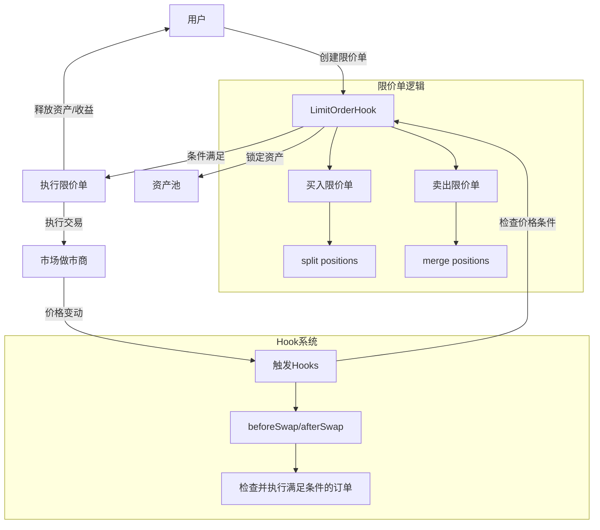
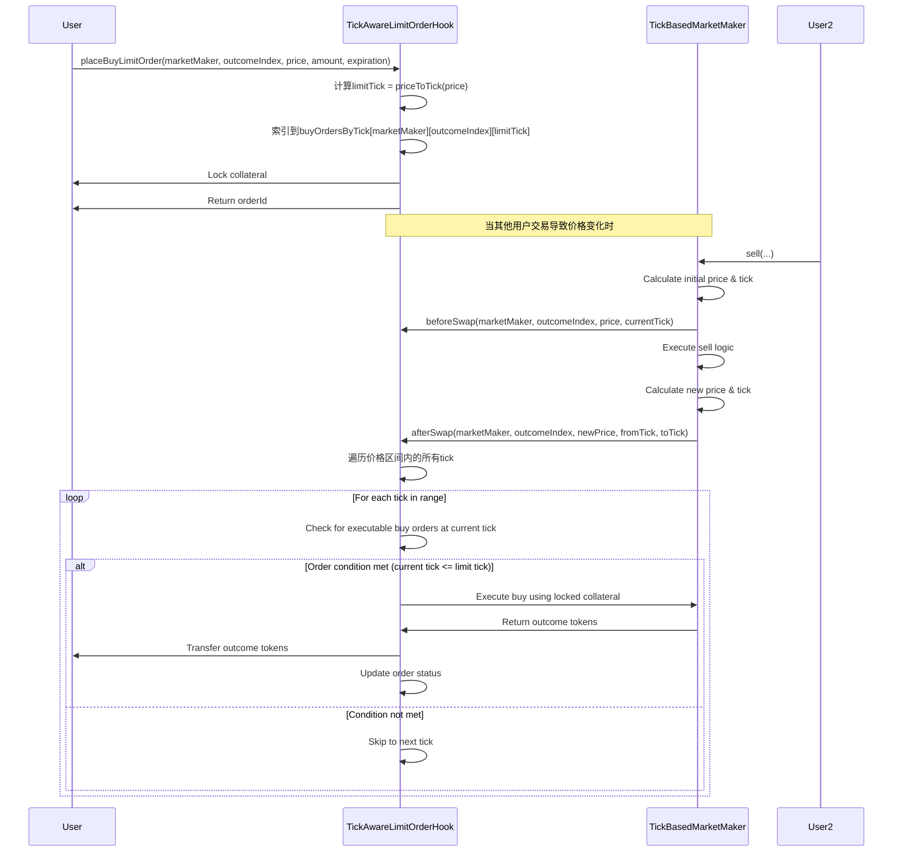
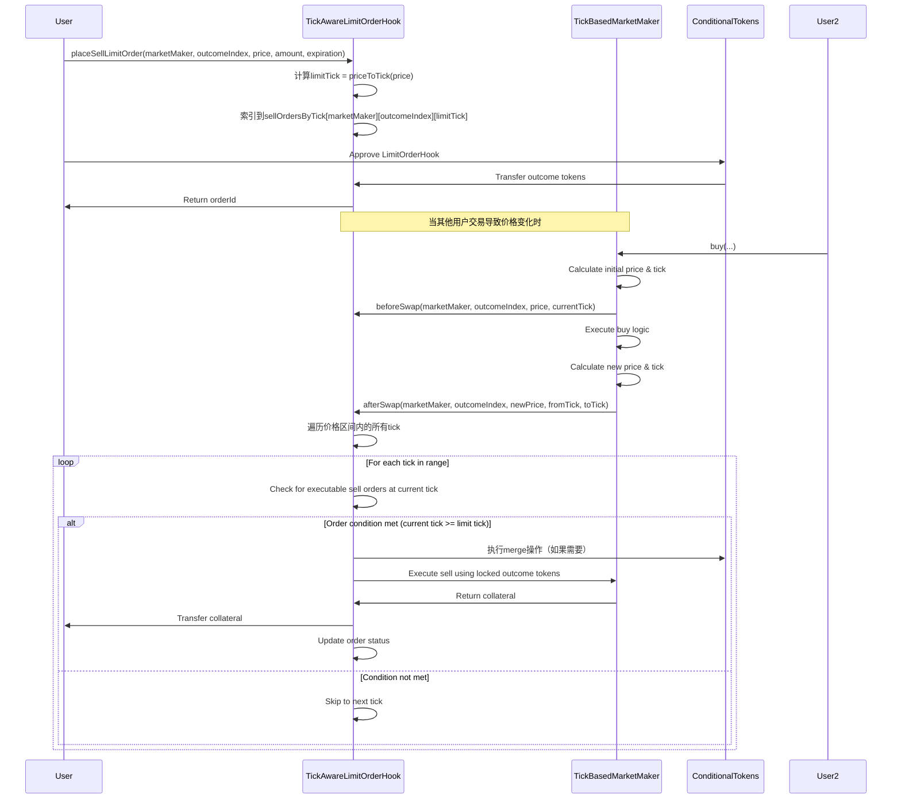

# Uniswap V4 风格的条件代币市场限价单系统设计

本文档描述了一个基于Uniswap V4 Hooks机制的条件代币市场限价单系统设计，旨在提供高效、可组合和链上执行的限价单功能。

## 1. 核心设计概念

从Uniswap V4的LimitOrder设计中，我们借鉴了以下关键概念：

1. **Hooks机制**：交易执行前后自动触发预定义的逻辑
2. **Range Orders**：基于流动性添加和移除的限价单机制
3. **自动执行**：无需外部keeper触发订单执行
4. **回调模式**：通过回调函数处理资产的锁定和释放

这些概念将适配到条件代币市场的特殊需求，特别是考虑到条件代币的split和merge操作。

## 2. 系统架构



## 3. 价格模型整合

### 3.1 连续曲线与离散Tick的整合

与Uniswap V4不同，条件代币市场的LMSR和FPMM模型基于连续曲线计算价格。我们需要将离散的Tick系统与这些连续曲线整合：

```solidity
// Tick系统定义
contract TickSystem {
    // 定义tick间隔，较小以提供更精细的价格点
    int24 public constant TICK_SPACING = 10;
    
    // 价格到tick的映射
    function priceToTick(uint256 price) public pure returns (int24) {
        // 使用对数函数将连续价格映射到离散tick
        // 基数选择1.0001以保持与Uniswap兼容
        return int24(log1.0001(price / FixedPoint96.Q96));
    }
    
    // tick到价格的映射
    function tickToPrice(int24 tick) public pure returns (uint256) {
        return FixedPoint96.Q96 * uint256(1.0001 ** tick);
    }
    
    // 获取当前tick
    function getCurrentTick(uint256 price) public pure returns (int24) {
        return priceToTick(price);
    }
    
    // 获取下一个tick的价格
    function getNextTickPrice(uint256 price, bool isIncreasing) public pure returns (uint256) {
        int24 currentTick = priceToTick(price);
        int24 nextTick = isIncreasing ? currentTick + TICK_SPACING : currentTick - TICK_SPACING;
        return tickToPrice(nextTick);
    }
}
```

### 3.2 买入/卖出操作与Tick整合

原始的buy/sell操作在连续价格曲线上执行，我们需要调整这些操作以适应Tick系统：

```solidity
contract TickBasedMarketMaker is HookableMarketMaker, TickSystem {
    // 现有的买入操作
    function buy(uint investmentAmount, uint outcomeIndex, uint minOutcomeTokens) external {
        // 获取当前价格和tick
        uint currentPrice = calculateOutcomePrice(outcomeIndex);
        int24 currentTick = priceToTick(currentPrice);
        
        // 调用beforeSwap
        if (address(limitOrderHook) != address(0)) {
            limitOrderHook.beforeSwap(address(this), outcomeIndex, currentPrice, currentTick);
        }
        
        // 执行原始买入逻辑
        super.buy(investmentAmount, outcomeIndex, minOutcomeTokens);
        
        // 获取新价格和tick
        uint newPrice = calculateOutcomePrice(outcomeIndex);
        int24 newTick = priceToTick(newPrice);
        
        // 调用afterSwap，传递价格变化的tick区间
        if (address(limitOrderHook) != address(0)) {
            limitOrderHook.afterSwap(address(this), outcomeIndex, newPrice, currentTick, newTick);
        }
    }
    
    // 现有的卖出操作
    function sell(uint returnAmount, uint outcomeIndex, uint maxOutcomeTokens) external {
        // 获取当前价格和tick
        uint currentPrice = calculateOutcomePrice(outcomeIndex);
        int24 currentTick = priceToTick(currentPrice);
        
        // 调用beforeSwap
        if (address(limitOrderHook) != address(0)) {
            limitOrderHook.beforeSwap(address(this), outcomeIndex, currentPrice, currentTick);
        }
        
        // 执行原始卖出逻辑
        super.sell(returnAmount, outcomeIndex, maxOutcomeTokens);
        
        // 获取新价格和tick
        uint newPrice = calculateOutcomePrice(outcomeIndex);
        int24 newTick = priceToTick(newPrice);
        
        // 调用afterSwap，传递价格变化的tick区间
        if (address(limitOrderHook) != address(0)) {
            limitOrderHook.afterSwap(address(this), outcomeIndex, newPrice, currentTick, newTick);
        }
    }
}
```

### 3.3 限价单执行器与Tick系统

Hook需要检查所有价格经过的tick，而不仅仅是最终价格：

```solidity
// 扩展限价单Hook接口
interface ILimitOrderHook {
    // 更新后的接口包含tick信息
    function beforeSwap(address marketMaker, uint outcomeIndex, uint currentPrice, int24 currentTick) external;
    
    // 交易后回调包含tick区间信息
    function afterSwap(address marketMaker, uint outcomeIndex, uint newPrice, int24 fromTick, int24 toTick) external;
}

contract TickAwareLimitOrderHook is LimitOrderHook, TickSystem {
    // 订单结构增加tick信息
    struct Order {
        // 现有字段
        address owner;
        bool isBuyOrder;
        uint outcomeIndex;
        uint price;
        uint amount;
        uint filled;
        uint expiration;
        bool active;
        
        // 新增tick字段
        int24 limitTick; // 限价对应的tick
    }
    
    // 按tick索引的订单
    mapping(address => mapping(uint => mapping(int24 => uint[]))) public buyOrdersByTick;
    mapping(address => mapping(uint => mapping(int24 => uint[]))) public sellOrdersByTick;
    
    // 创建买入限价单时计算并存储tick
    function placeBuyLimitOrder(
        IMarketMaker marketMaker,
        uint outcomeIndex,
        uint price,
        uint amount,
        uint expiration
    ) external returns (uint256 orderId) {
        // 计算价格对应的tick
        int24 limitTick = priceToTick(price);
        
        // 现有逻辑...
        
        // 创建订单时包含tick信息
        orders[orderId] = Order({
            owner: msg.sender,
            isBuyOrder: true,
            outcomeIndex: outcomeIndex,
            price: price,
            limitTick: limitTick,
            amount: amount,
            filled: 0,
            expiration: expiration == 0 ? 0 : block.timestamp + expiration,
            active: true
        });
        
        // 添加到按tick索引的映射
        buyOrdersByTick[address(marketMaker)][outcomeIndex][limitTick].push(orderId);
        
        // 现有逻辑...
    }
    
    // 实现afterSwap，检查整个tick区间
    function afterSwap(address marketMaker, uint outcomeIndex, uint newPrice, int24 fromTick, int24 toTick) external override {
        // 确定遍历方向
        bool priceIncreased = fromTick < toTick;
        
        if (priceIncreased) {
            // 价格上升：检查卖单
            for (int24 tick = fromTick; tick <= toTick; tick += TICK_SPACING) {
                executeSellOrdersAtTick(marketMaker, outcomeIndex, tick);
            }
        } else {
            // 价格下降：检查买单
            for (int24 tick = fromTick; tick >= toTick; tick -= TICK_SPACING) {
                executeBuyOrdersAtTick(marketMaker, outcomeIndex, tick);
            }
        }
    }
    
    // 执行特定tick的买单
    function executeBuyOrdersAtTick(address marketMaker, uint outcomeIndex, int24 tick) internal {
        uint[] storage orderIds = buyOrdersByTick[marketMaker][outcomeIndex][tick];
        
        for (uint i = 0; i < orderIds.length; i++) {
            Order storage order = orders[orderIds[i]];
            
            if (order.active && order.filled < order.amount) {
                if (order.expiration == 0 || block.timestamp <= order.expiration) {
                    executeOrder(orderIds[i], marketMaker, tickToPrice(tick));
                }
            }
        }
    }
    
    // 执行特定tick的卖单
    function executeSellOrdersAtTick(address marketMaker, uint outcomeIndex, int24 tick) internal {
        uint[] storage orderIds = sellOrdersByTick[marketMaker][outcomeIndex][tick];
        
        for (uint i = 0; i < orderIds.length; i++) {
            Order storage order = orders[orderIds[i]];
            
            if (order.active && order.filled < order.amount) {
                if (order.expiration == 0 || block.timestamp <= order.expiration) {
                    executeOrder(orderIds[i], marketMaker, tickToPrice(tick));
                }
            }
        }
    }
}
```

## 4. 买入/卖出逻辑的特殊处理

### 4.1 买入交易与连续价格曲线

条件代币市场的买入操作会改变整个价格曲线，我们需要考虑这种影响：

```solidity
// 模拟买入对价格曲线的影响
function simulateBuyImpact(
    IMarketMaker marketMaker,
    uint outcomeIndex,
    uint investmentAmount
) public view returns (uint newPrice, int24 fromTick, int24 toTick) {
    // 获取当前价格和tick
    uint currentPrice = marketMaker.calculateOutcomePrice(outcomeIndex);
    fromTick = priceToTick(currentPrice);
    
    // 计算买入后的新价格（简化版，实际实现需要考虑做市商的具体公式）
    uint[] memory balances = marketMaker.getPoolBalances();
    uint totalBalance = 0;
    
    for (uint i = 0; i < balances.length; i++) {
        totalBalance += balances[i];
    }
    
    // 模拟买入后余额变化
    uint newTotalBalance = totalBalance + investmentAmount;
    uint newOutcomeBalance = balances[outcomeIndex] + investmentAmount * (1 - marketMaker.fee() / 1e18);
    
    // 计算新价格
    newPrice = (newOutcomeBalance * 1e18) / newTotalBalance;
    
    // 计算新tick
    toTick = priceToTick(newPrice);
    
    return (newPrice, fromTick, toTick);
}
```

### 4.2 卖出交易的特殊处理

卖出操作需要考虑条件代币的merge操作：

```solidity
// 执行卖出限价单
function executeSell(uint256 orderId, address marketMaker, uint currentPrice) internal {
    Order storage order = orders[orderId];
    
    // 获取positionId
    uint positionId = getPositionId(IMarketMaker(marketMaker), order.outcomeIndex);
    
    // 对于条件代币，需要先执行merge操作将锁定的代币合并
    if (needsMerge(IMarketMaker(marketMaker))) {
        bytes32[] memory conditionIds = IMarketMaker(marketMaker).getConditionIds();
        handleSellOrderMerge(IMarketMaker(marketMaker), order.amount);
    }
    
    // 计算预期返还的抵押品数量
    uint expectedCollateral = calculateSellReturn(IMarketMaker(marketMaker), order.outcomeIndex, order.amount);
    
    // 只有当返还数量足够时才执行
    if (expectedCollateral >= order.price * order.amount / 1e18) {
        // 设置安全的最小返还量
        uint minReturn = expectedCollateral * 98 / 100; // 2% slippage protection
        
        // 执行卖出操作
        IMarketMaker(marketMaker).sell(order.amount, order.outcomeIndex, minReturn);
        
        // 获取实际收到的抵押品
        IERC20 collateralToken = IERC20(IMarketMaker(marketMaker).collateralToken());
        uint collateralBalance = collateralToken.balanceOf(address(this));
        
        // 将收益转给用户
        collateralToken.transfer(order.owner, collateralBalance);
        
        // 更新订单状态
        order.filled = order.amount;
        order.active = false;
    }
}
```

## 5. Tick系统与现有价格机制的影响

### 5.1 LMSR模型的适配

对数市场评分规则(LMSR)使用指数函数计算价格，需要特殊处理：

```solidity
// LMSR市场的Tick适配器
contract LMSRTickAdapter {
    using SafeMath for uint;
    
    // LMSR使用b参数来调整价格曲线
    uint public fundingParameter;
    
    constructor(uint _fundingParameter) public {
        fundingParameter = _fundingParameter;
    }
    
    // 计算LMSR价格对应的tick
    function lmsrPriceToTick(uint lmsrPrice) public view returns (int24) {
        // LMSR价格已经是0-1范围内的概率值
        // 将其转换为tick空间
        return priceToTick(lmsrPrice * 1e18);
    }
    
    // 给定买单金额，计算价格变化的tick区间
    function calculateTickRange(
        uint[] memory balances, 
        uint outcomeIndex,
        uint investmentAmount
    ) public view returns (int24 fromTick, int24 toTick) {
        // 计算当前价格
        uint currentPrice = calculateLMSRPrice(balances, outcomeIndex);
        fromTick = lmsrPriceToTick(currentPrice);
        
        // 模拟买入后的余额
        uint[] memory newBalances = new uint[](balances.length);
        for (uint i = 0; i < balances.length; i++) {
            newBalances[i] = balances[i];
        }
        
        // 更新目标结果的余额
        newBalances[outcomeIndex] = newBalances[outcomeIndex].add(investmentAmount);
        
        // 计算新价格
        uint newPrice = calculateLMSRPrice(newBalances, outcomeIndex);
        toTick = lmsrPriceToTick(newPrice);
        
        return (fromTick, toTick);
    }
    
    // 简化的LMSR价格计算
    function calculateLMSRPrice(uint[] memory balances, uint outcomeIndex) internal view returns (uint) {
        // LMSR公式: price_i = e^(q_i/b) / sum(e^(q_j/b))
        // 这里仅为示例，实际实现需要考虑溢出和精度问题
        return 0; // 具体实现省略
    }
}
```

### 5.2 FPMM模型的适配

固定产品市场做市商(FPMM)使用恒定乘积公式，也需要特殊处理：

```solidity
// FPMM市场的Tick适配器
contract FPMMTickAdapter {
    // 计算FPMM价格对应的tick
    function fpmmPriceToTick(uint fpmmPrice) public pure returns (int24) {
        // FPMM价格也是0-1范围的概率
        return priceToTick(fpmmPrice * 1e18);
    }
    
    // 给定买单金额，计算价格变化的tick区间
    function calculateTickRange(
        uint[] memory balances,
        uint outcomeIndex,
        uint investmentAmount,
        uint fee
    ) public pure returns (int24 fromTick, int24 toTick) {
        // 计算当前价格
        uint currentPrice = calculateFPMMPrice(balances, outcomeIndex);
        fromTick = fpmmPriceToTick(currentPrice);
        
        // 计算买入后的新余额
        uint[] memory newBalances = new uint[](balances.length);
        uint feeAmount = investmentAmount.mul(fee).div(1e18);
        uint investmentAmountMinusFee = investmentAmount.sub(feeAmount);
        
        // 计算买入后的余额分布
        // 注意：这是简化版本，实际FPMM的买入逻辑更复杂
        for (uint i = 0; i < balances.length; i++) {
            if (i == outcomeIndex) {
                newBalances[i] = balances[i].add(investmentAmountMinusFee);
            } else {
                newBalances[i] = balances[i];
            }
        }
        
        // 计算新价格
        uint newPrice = calculateFPMMPrice(newBalances, outcomeIndex);
        toTick = fpmmPriceToTick(newPrice);
        
        return (fromTick, toTick);
    }
    
    // 简化的FPMM价格计算
    function calculateFPMMPrice(uint[] memory balances, uint outcomeIndex) internal pure returns (uint) {
        // FPMM公式: price_i = balance_i / sum(balance_j)
        uint totalBalance = 0;
        for (uint i = 0; i < balances.length; i++) {
            totalBalance = totalBalance.add(balances[i]);
        }
        
        return balances[outcomeIndex].mul(1e18).div(totalBalance);
    }
}
```

## 6. 限价单执行流程（修订版）

### 6.1 买入限价单流程



### 6.2 卖出限价单流程



## 7. 优势与挑战（更新）

### 7.1 Tick系统的优势

1. **精确定价**：用户可以指定精确的价格点
2. **高效查询**：按tick索引订单，减少扫描成本
3. **公平执行**：确保所有价格点都被检查，不会错过执行机会
4. **与Uniswap V4兼容**：使用相同的tick系统便于跨协议集成

### 7.2 实施挑战（更新）

1. **连续曲线到离散Tick的映射**：需要精确计算价格区间内的所有tick
2. **性能考量**：检查整个tick区间可能导致gas消耗增加
3. **Split/Merge处理**：需要特殊处理条件代币的split和merge操作
4. **价格模型差异**：需要为LMSR和FPMM提供不同的适配器

## 8. 结论

通过将Uniswap V4的Hooks风格限价单系统与tick系统适配到条件代币市场，我们实现了一个高效、精确的限价单执行机制。这种设计特别关注了将连续价格曲线映射到离散tick空间的挑战，同时保持了对条件代币特殊操作（split和merge）的支持。

虽然整合tick系统增加了实现复杂度，但它提供的精确定价和高效执行优势使得这种设计非常适合现代预测市场的需求。不同的价格模型（LMSR和FPMM）都可以通过专门的适配器集成到这个系统中，使其具有广泛的适用性。 