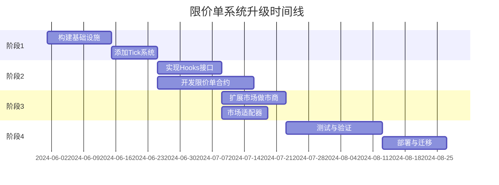

# 条件代币市场支持限价单的升级实施计划

本文档详细说明了将现有条件代币市场做市商系统升级为支持限价单功能的实施步骤。

## 1. 升级概述

现有系统主要基于FPMM（固定产品市场做市商）和LMSR（对数市场评分规则）模型，我们将通过引入Uniswap V4风格的Hooks机制和Tick系统来实现限价单功能。整个升级过程将分为多个阶段实施，以确保系统稳定性和向后兼容性。



## 2. 详细升级步骤

### 阶段1：构建基础设施

#### 步骤1.1：设计与规划（预计时间：1周）

1. **详细分析现有合约**
   - 审查`FixedProductMarketMaker.sol`和`LMSRMarketMaker.sol`的当前实现
   - 识别需要修改的关键点
   - 确定对现有功能的潜在影响

2. **定义接口规范**
   - 设计Hooks接口
   - 设计Tick系统接口
   - 定义限价单合约接口

3. **确定测试策略**
   - 制定单元测试计划
   - 设计集成测试场景
   - 建立性能测试基准

#### 步骤1.2：添加Tick系统（预计时间：1.5周）

1. **实现Tick数学库**
   ```solidity
   // 创建新文件: contracts/libraries/TickMath.sol
   pragma solidity ^0.5.1;
   
   library TickMath {
       // Tick计算相关常量
       int24 public constant MIN_TICK = -887272;
       int24 public constant MAX_TICK = 887272;
       int24 public constant TICK_SPACING = 10;
   
       // 价格到Tick的转换
       function priceToTick(uint256 price) internal pure returns (int24) {
           // 实现
       }
   
       // Tick到价格的转换
       function tickToPrice(int24 tick) internal pure returns (uint256) {
           // 实现
       }
   }
   ```

2. **创建价格模型适配器抽象合约**
   ```solidity
   // 创建新文件: contracts/adapters/PriceModelAdapter.sol
   pragma solidity ^0.5.1;
   
   import "../libraries/TickMath.sol";
   
   abstract contract PriceModelAdapter {
       function convertPriceToTick(uint256 price) public view virtual returns (int24);
       function calculatePriceImpact(uint256[] memory balances, uint outcomeIndex, uint tradeAmount, bool isBuy)
           public view virtual returns (uint256 newPrice, int24 fromTick, int24 toTick);
   }
   ```

### 阶段2：实现Hooks和限价单核心逻辑

#### 步骤2.1：创建Hooks接口（预计时间：1周）

1. **定义Hook接口**
   ```solidity
   // 创建新文件: contracts/interfaces/IMarketHook.sol
   pragma solidity ^0.5.1;
   
   interface IMarketHook {
       function beforeSwap(
           address marketMaker,
           uint outcomeIndex,
           uint amount,
           bool isBuy,
           uint currentPrice,
           int24 currentTick
       ) external;
   
       function afterSwap(
           address marketMaker,
           uint outcomeIndex,
           uint amount,
           bool isBuy,
           uint newPrice,
           int24 fromTick,
           int24 toTick
       ) external;
   }
   ```

2. **开发Hook注册表**
   ```solidity
   // 创建新文件: contracts/HookRegistry.sol
   pragma solidity ^0.5.1;
   
   import "./interfaces/IMarketHook.sol";
   
   contract HookRegistry {
       mapping(address => IMarketHook) public marketHooks;
       mapping(address => bool) public authorizedCallers;
       address public owner;
   
       // 实现权限和注册逻辑
   }
   ```

#### 步骤2.2：开发限价单合约（预计时间：2周）

1. **实现限价单核心合约**
   ```solidity
   // 创建新文件: contracts/LimitOrderHook.sol
   pragma solidity ^0.5.1;
   
   import "./interfaces/IMarketHook.sol";
   import "./libraries/TickMath.sol";
   import "@gnosis.pm/conditional-tokens-contracts/contracts/ConditionalTokens.sol";
   
   contract LimitOrderHook is IMarketHook {
       // 订单结构
       struct Order {
           address owner;
           bool isBuyOrder;
           uint outcomeIndex;
           uint price;
           int24 limitTick;
           uint amount;
           uint filled;
           uint expiration;
           bool active;
       }
   
       // 实现订单存储和管理
       // 实现afterSwap和beforeSwap方法
       // 添加订单执行逻辑
   }
   ```

2. **开发订单索引系统**
   ```solidity
   // 向LimitOrderHook添加
   // 按Tick索引的订单映射
   mapping(address => mapping(uint => mapping(int24 => uint[]))) public buyOrdersByTick;
   mapping(address => mapping(uint => mapping(int24 => uint[]))) public sellOrdersByTick;
   
   // 高效的订单检索函数
   function findExecutableOrders(...) internal returns (...) {
       // 实现
   }
   ```

### 阶段3：扩展市场做市商合约

#### 步骤3.1：更新市场做市商合约（预计时间：1.5周）

1. **修改FPMM合约以支持Hooks**
   ```solidity
   // 创建新文件: contracts/HookableFixedProductMarketMaker.sol
   pragma solidity ^0.5.1;
   
   import "./FixedProductMarketMaker.sol";
   import "./interfaces/IMarketHook.sol";
   import "./HookRegistry.sol";
   
   contract HookableFixedProductMarketMaker is FixedProductMarketMaker {
       HookRegistry public hookRegistry;
   
       constructor(
           ConditionalTokens _conditionalTokens,
           IERC20 _collateralToken,
           bytes32[] memory _conditionIds,
           uint _fee,
           HookRegistry _hookRegistry
       ) FixedProductMarketMaker(_conditionalTokens, _collateralToken, _conditionIds, _fee) public {
           hookRegistry = _hookRegistry;
       }
   
       // 重写buy方法
       function buy(uint investmentAmount, uint outcomeIndex, uint minOutcomeTokens) external {
           // 获取当前价格和tick
           uint currentPrice = calculateOutcomePrice(outcomeIndex);
           int24 currentTick = TickMath.priceToTick(currentPrice);
   
           // 调用beforeSwap
           IMarketHook hook = hookRegistry.marketHooks(address(this));
           if (address(hook) != address(0)) {
               hook.beforeSwap(address(this), outcomeIndex, investmentAmount, true, currentPrice, currentTick);
           }
   
           // 执行原始买入逻辑
           super.buy(investmentAmount, outcomeIndex, minOutcomeTokens);
   
           // 获取新价格和tick
           uint newPrice = calculateOutcomePrice(outcomeIndex);
           int24 newTick = TickMath.priceToTick(newPrice);
   
           // 调用afterSwap
           if (address(hook) != address(0)) {
               hook.afterSwap(address(this), outcomeIndex, investmentAmount, true, newPrice, currentTick, newTick);
           }
       }
   
       // 类似地重写sell方法
   
       // 新增价格计算方法
       function calculateOutcomePrice(uint outcomeIndex) public view returns (uint) {
           uint[] memory balances = getPoolBalances();
           uint totalBalance = 0;
           
           for (uint i = 0; i < balances.length; i++) {
               totalBalance += balances[i];
           }
           
           if (totalBalance == 0) return 0;
           return balances[outcomeIndex] * 1e18 / totalBalance;
       }
   }
   ```

2. **为LMSR创建类似的可钩子版本**

#### 步骤3.2：创建市场工厂合约（预计时间：1周）

1. **更新工厂合约以部署支持Hooks的市场**
   ```solidity
   // 创建新文件: contracts/HookableFixedProductMarketMakerFactory.sol
   pragma solidity ^0.5.1;
   
   import "./HookableFixedProductMarketMaker.sol";
   import "./HookRegistry.sol";
   
   contract HookableFixedProductMarketMakerFactory {
       HookRegistry public hookRegistry;
       
       constructor(HookRegistry _hookRegistry) public {
           hookRegistry = _hookRegistry;
       }
       
       function createMarketMaker(
           ConditionalTokens conditionalTokens,
           IERC20 collateralToken,
           bytes32[] calldata conditionIds,
           uint fee
       ) external returns (HookableFixedProductMarketMaker) {
           HookableFixedProductMarketMaker marketMaker = new HookableFixedProductMarketMaker(
               conditionalTokens,
               collateralToken,
               conditionIds,
               fee,
               hookRegistry
           );
           
           // 转移所有权等其他初始化逻辑
           
           return marketMaker;
       }
   }
   ```

### 阶段4：测试与部署

#### 步骤4.1：编写全面的测试（预计时间：2周）

1. **单元测试**
   ```javascript
   // 创建新文件: test/test-limit-orders.js
   const HookableFixedProductMarketMaker = artifacts.require('HookableFixedProductMarketMaker')
   const LimitOrderHook = artifacts.require('LimitOrderHook')
   const HookRegistry = artifacts.require('HookRegistry')
   
   contract('LimitOrderSystem', function(accounts) {
       // 测试用例设置
       
       // 测试限价单创建
       it('should create a buy limit order', async () => {
           // 实现
       })
       
       // 测试限价单执行
       it('should execute limit order when price condition is met', async () => {
           // 实现
       })
       
       // 测试边界条件
       // 测试错误情况
   })
   ```

2. **集成测试**
   - 测试完整交易流程
   - 测试多个订单同时执行情况
   - 测试gas使用情况

#### 步骤4.2：准备部署和迁移策略（预计时间：1周）

1. **合约部署脚本**
   ```javascript
   // 创建新文件: migrations/3_deploy_limit_order_system.js
   const HookRegistry = artifacts.require('HookRegistry')
   const LimitOrderHook = artifacts.require('LimitOrderHook')
   const HookableFixedProductMarketMakerFactory = artifacts.require('HookableFixedProductMarketMakerFactory')
   const ConditionalTokens = artifacts.require('ConditionalTokens')
   
   module.exports = async function(deployer, network, accounts) {
     // 部署Hook注册表
     await deployer.deploy(HookRegistry)
     const hookRegistry = await HookRegistry.deployed()
     
     // 获取已部署的条件代币合约
     const conditionalTokens = await ConditionalTokens.deployed()
     
     // 部署限价单Hook
     await deployer.deploy(LimitOrderHook, conditionalTokens.address, hookRegistry.address)
     const limitOrderHook = await LimitOrderHook.deployed()
     
     // 部署可钩子市场工厂
     await deployer.deploy(HookableFixedProductMarketMakerFactory, hookRegistry.address)
     
     // 配置权限
     await hookRegistry.authorizeHook(limitOrderHook.address, true)
   }
   ```

2. **备份和数据迁移计划**
   - 制定现有合约数据的备份策略
   - 计划如何处理现有市场和用户资产

#### 步骤4.3：安全审计和最终部署（预计时间：2周）

1. **安全审计**
   - 进行内部安全审查
   - 考虑聘请外部审计团队
   - 解决发现的安全问题

2. **最终部署和监控**
   - 分阶段部署
   - 设置监控系统
   - 准备应急回退计划

## 3. 后续扩展和优化

完成基本升级后，可以考虑以下扩展和优化：

1. **高级订单类型**
   - 实现范围订单（Range Orders）
   - 添加时间加权订单
   - 支持条件订单（If-Then订单）

2. **性能优化**
   - 优化gas消耗
   - 提高批量处理效率
   - 实现更高效的订单索引

3. **用户界面整合**
   - 开发限价单操作的前端组件
   - 提供订单管理界面
   - 实现订单可视化

## 4. 风险管理

### 主要风险及缓解措施

| 风险类型 | 描述 | 缓解措施 |
|---------|------|----------|
| 合约漏洞 | 新代码可能引入安全漏洞 | 全面测试、代码审计、形式化验证 |
| 不兼容性 | 升级可能破坏现有功能 | 维护向后兼容性、分阶段部署 |
| Gas成本 | 新功能可能增加交易成本 | 优化合约代码、批量处理 |
| 复杂性增加 | 系统变得更复杂难以维护 | 模块化设计、详细文档 |
| 市场影响 | 升级时可能扰乱市场活动 | 提前通知、非高峰时间部署 |

### 应急回退计划

1. **监控指标**
   - 定义关键性能指标
   - 设置监控阈值

2. **回退触发条件**
   - 明确定义需要回退的情况
   - 建立决策流程

3. **回退执行计划**
   - 准备回退脚本
   - 测试回退流程

## 5. 结论

本升级计划提供了一个结构化的方法，将现有条件代币市场系统升级为支持基于Uniswap V4风格的限价单功能。通过分阶段实施，我们可以确保安全、平稳地引入这一关键功能，同时保持系统的稳定性和可靠性。

实施此计划将显著提升条件代币市场的功能性和用户体验，使其更接近传统交易所的交易机制，同时保持去中心化系统的优势。 